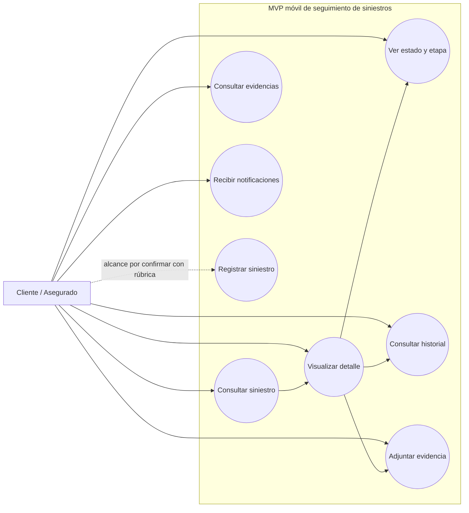
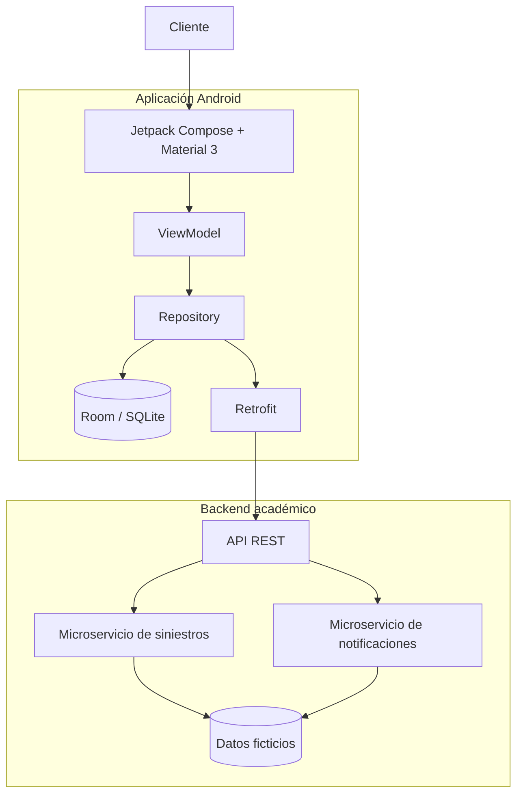
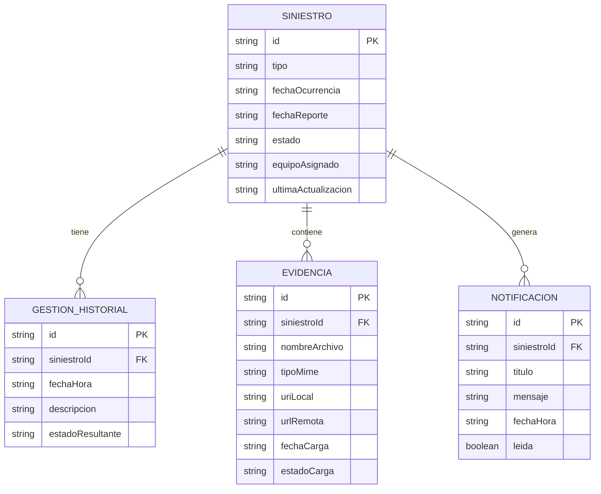
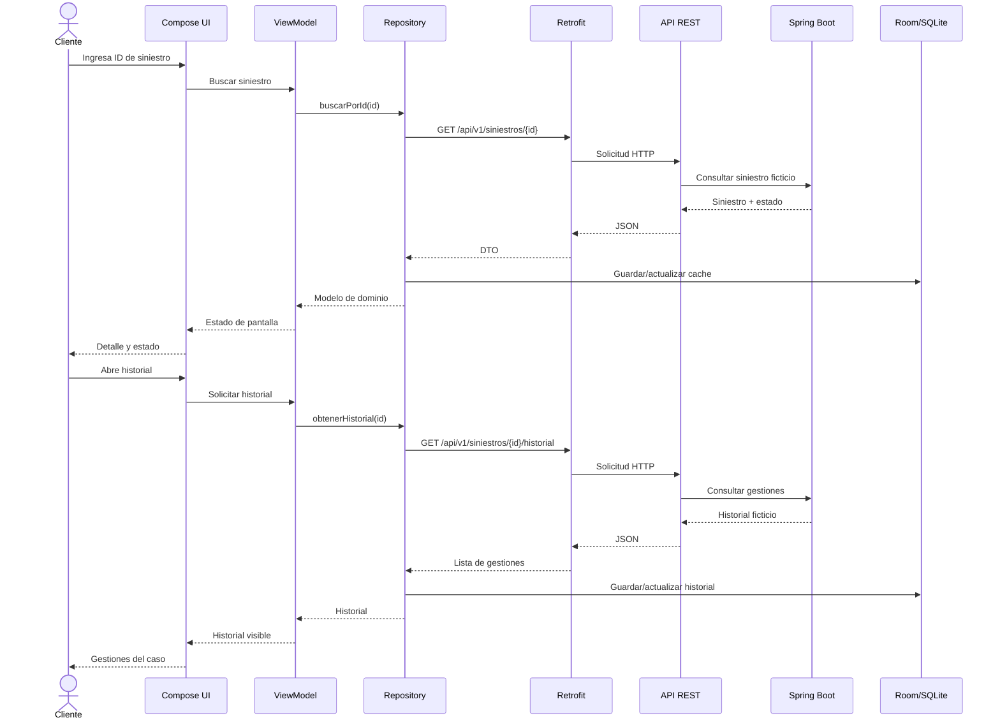

# Documentación

## Proyecto

**Asignatura:** DSY1105 Desarrollo de Aplicaciones Móviles  
**Proyecto:** Seguimiento móvil del estado de siniestros para clientes de servicios BPO  
**Organización del caso:** Servicios Corporativos Andes SpA  
**Tipo de solución:** MVP académico Android  
**Documento base:** Caso oficial DSY1105  
**Estado:** Documento vivo y fuente oficial del proyecto

---

# 1. Propósito

Este documento es la **fuente oficial de verdad del proyecto** dentro del repositorio GitHub.

Reúne los requerimientos funcionales y no funcionales del sistema, las decisiones relevantes de alcance y el estado real de implementación.

Cuando un cambio afecte alguno de estos elementos, este archivo debe actualizarse junto con el desarrollo:

- alcance del MVP,
- requerimientos funcionales,
- requerimientos no funcionales,
- arquitectura,
- tecnologías,
- modelos de datos,
- pantallas y navegación,
- API,
- persistencia,
- integraciones,
- pruebas,
- decisiones técnicas importantes,
- estado de implementación.

Los documentos ubicados en la carpeta `docs/` son complementarios. Si existiera una contradicción entre un documento complementario y este archivo, se debe revisar y corregir la inconsistencia para que `DOCUMENTACION.md` represente el estado vigente del proyecto.

GitHub es el lugar oficial donde se mantiene esta documentación versionada. Herramientas de comunicación como Discord pueden utilizarse para coordinación, avisos o conversación del equipo, pero no reemplazan la documentación del repositorio.

## 1.1 Regla de actualización

El flujo de trabajo será:

```text
Cambio de código, alcance o decisión
        ↓
Revisar impacto documental
        ↓
Actualizar DOCUMENTACION.md si corresponde
        ↓
Pull Request
        ↓
Revisión
        ↓
develop
```

Una tarea que cambie de forma relevante el sistema no se considera completamente cerrada si la documentación correspondiente quedó desactualizada.

## 1.2 Clasificación del origen

Se distinguen los siguientes tipos de origen:

- **Caso oficial:** aparece de forma explícita en el caso DSY1105.
- **Derivado del caso:** se incorpora porque es necesario para implementar correctamente una tarea descrita en el caso.
- **Rúbrica:** requisito o ajuste definido por la pauta oficial cuando esté disponible.
- **Decisión técnica:** elección del equipo para implementar el sistema sin alterar el objetivo del caso.

Los requerimientos describen el objetivo final del MVP. Que un requisito aparezca en este documento no significa necesariamente que ya esté implementado.

---

# 2. Descripción general

El proyecto busca resolver la falta de visibilidad del cliente sobre el estado de su siniestro y reducir la dependencia de canales manuales como teléfono, correo u oficina.

La solución consiste en un MVP móvil Android que permita al cliente consultar y hacer seguimiento de un siniestro, revisar su estado e historial, adjuntar evidencia y recibir notificaciones ante cambios relevantes.

El sistema trabajará únicamente con datos ficticios, sintéticos o anonimizados.

---

# 3. Requerimientos funcionales

Los requerimientos funcionales representan acciones o comportamientos que el sistema debe ofrecer al usuario.

## RF-01. Consultar un siniestro

**Origen:** Caso oficial  
**Estado actual:** Implementado con datos ficticios locales.

El sistema debe permitir que el cliente consulte un siniestro utilizando un identificador ficticio.

### Criterios de aceptación

- El usuario puede ingresar un identificador.
- El sistema busca el siniestro correspondiente.
- Si existe, muestra su información.
- Si no existe, informa el resultado de forma clara.

---

## RF-02. Registrar un siniestro

**Origen:** Caso oficial, alcance exacto pendiente de rúbrica.  
**Estado actual:** Pendiente.

El caso establece que las tareas del cliente consideran **registrar o consultar un siniestro**.

Por esta razón, el proyecto contempla el registro de un siniestro como parte del alcance posible, pero no se asumirá un flujo de registro completo hasta revisar la rúbrica oficial.

En caso de implementarse, utilizará únicamente información ficticia como:

- tipo de siniestro,
- fecha de ocurrencia,
- fecha de reporte,
- identificador ficticio.

---

## RF-03. Visualizar el detalle del siniestro

**Origen:** Derivado del caso.  
**Estado actual:** Implementado con datos ficticios locales.

Una vez consultado un siniestro, el sistema debe presentar la información necesaria para comprender el caso.

La información considerada es:

- identificador,
- tipo de siniestro,
- fecha de ocurrencia,
- fecha de reporte,
- estado actual,
- equipo o colaborador asignado de forma referencial,
- última actualización cuando esté disponible.

---

## RF-04. Visualizar el estado y la etapa del siniestro

**Origen:** Caso oficial.  
**Estado actual:** Implementado con datos ficticios locales.

El sistema debe permitir que el cliente identifique claramente el estado actual de su siniestro.

Los estados definidos por el caso son:

1. Recibido.
2. En evaluación.
3. En liquidación.
4. Cerrado.

---

## RF-05. Consultar el historial de gestiones

**Origen:** Caso oficial.  
**Estado actual:** Implementado con datos ficticios locales.

El sistema debe permitir revisar el historial de gestiones realizadas sobre el siniestro.

Cada gestión puede mostrar:

- fecha y hora,
- descripción,
- estado resultante.

El historial debe mostrarse de manera ordenada y comprensible.

---

## RF-06. Adjuntar evidencia o documentación

**Origen:** Caso oficial.  
**Estado actual:** Pendiente.

El cliente debe poder adjuntar evidencia o documentación de respaldo asociada a su siniestro.

La solución debe contemplar:

- imágenes,
- documentos PDF sintéticos,
- uso de cámara cuando corresponda.

No se utilizarán archivos personales reales durante el desarrollo, las pruebas ni la demostración.

---

## RF-07. Consultar las evidencias asociadas

**Origen:** Derivado del caso.  
**Estado actual:** Pendiente.

Para permitir una experiencia coherente después de adjuntar documentación, el sistema podrá mostrar las evidencias asociadas al siniestro.

Este requerimiento es derivado. El caso exige explícitamente adjuntar evidencia, pero no define una pantalla independiente de consulta de evidencias.

---

## RF-08. Recibir notificaciones ante cambios relevantes

**Origen:** Caso oficial.  
**Estado actual:** Pendiente.

El sistema debe informar al cliente cuando exista un cambio relevante en su siniestro.

Las notificaciones deben quedar relacionadas con el caso correspondiente.

El caso indica que debe considerarse el envío de notificaciones push ante cambios de estado. La implementación exacta de push se confirmará con la rúbrica oficial.

---

## RF-09. Reflejar cambios de estado en el seguimiento

**Origen:** Derivado del caso.  
**Estado actual:** Pendiente de integración con backend.

Cuando el estado de un siniestro cambie, la aplicación debe reflejar la nueva etapa y mantener la trazabilidad visible para el cliente.

La actualización debe quedar representada en el seguimiento y, cuando corresponda, en el historial y las notificaciones.

---

# 4. Requerimientos no funcionales

Los requerimientos no funcionales corresponden a restricciones técnicas, condiciones de calidad y características obligatorias de la solución.

## RNF-01. Plataforma Android

**Origen:** Caso oficial  
**Estado actual:** Cumplido.

La aplicación móvil debe estar orientada a teléfonos Android.

---

## RNF-02. Kotlin

**Origen:** Caso oficial  
**Estado actual:** Cumplido.

El frontend móvil debe desarrollarse utilizando Kotlin.

---

## RNF-03. Android Studio

**Origen:** Caso oficial  
**Estado actual:** Requisito de entorno del proyecto.

El proyecto debe ser compatible con el desarrollo y ejecución mediante Android Studio.

---

## RNF-04. Jetpack Compose

**Origen:** Caso oficial  
**Estado actual:** Cumplido.

La interfaz de usuario debe implementarse utilizando Jetpack Compose.

---

## RNF-05. Material Design 3

**Origen:** Caso oficial  
**Estado actual:** Cumplido.

La interfaz debe utilizar Material Design 3.

---

## RNF-06. Arquitectura MVVM

**Origen:** Caso oficial  
**Estado actual:** Cumplido en la estructura Android actual.

La aplicación debe utilizar arquitectura MVVM para mantener separadas la interfaz, el estado y la lógica de presentación.

---

## RNF-07. Persistencia local con Room/SQLite

**Origen:** Caso oficial  
**Estado actual:** Pendiente.

El frontend móvil debe utilizar Room/SQLite para la persistencia local requerida por el MVP.

La interfaz de usuario no debe acceder directamente a la base de datos.

---

## RNF-08. Integración mediante Retrofit

**Origen:** Caso oficial  
**Estado actual:** Pendiente.

La aplicación Android debe integrarse con el backend mediante Retrofit.

Las llamadas remotas deben mantenerse fuera de la capa de interfaz.

---

## RNF-09. Backend Spring Boot

**Origen:** Caso oficial  
**Estado actual:** Pendiente.

El backend del MVP debe desarrollarse utilizando Spring Boot.

---

## RNF-10. API REST

**Origen:** Caso oficial  
**Estado actual:** Pendiente.

El backend debe exponer una API REST que entregue la información necesaria para el funcionamiento del MVP.

---

## RNF-11. Microservicios

**Origen:** Caso oficial  
**Estado actual:** Pendiente.

El backend requerido por el caso debe utilizar microservicios Spring Boot.

La cantidad de servicios se mantendrá acotada a las responsabilidades necesarias para el MVP académico, evitando complejidad que no aporte al caso ni a la evaluación.

---

## RNF-12. Pruebas unitarias del backend

**Origen:** Caso oficial  
**Estado actual:** Pendiente.

El backend debe incorporar pruebas unitarias para validar sus funciones principales.

---

## RNF-13. Usabilidad

**Origen:** Caso oficial  
**Estado actual:** En aplicación continua durante el desarrollo.

La experiencia debe considerar usuarios de distintas edades y distintos niveles de familiaridad tecnológica.

La aplicación debe ser:

- simple,
- clara,
- comprensible,
- de bajo esfuerzo cognitivo.

---

## RNF-14. Privacidad y protección de datos

**Origen:** Caso oficial  
**Estado actual:** Cumplido en los datos actuales del proyecto.

No se utilizarán datos personales reales de asegurados.

Tampoco se utilizarán:

- pólizas reales,
- información médica real,
- información financiera real,
- credenciales reales,
- accesos a sistemas internos.

---

## RNF-15. Seguridad

**Origen:** Caso oficial  
**Estado actual:** Requisito transversal.

La solución debe considerar buenas prácticas de seguridad y protección de datos personales.

---

## RNF-16. Datos ficticios, sintéticos o anonimizados

**Origen:** Caso oficial  
**Estado actual:** Cumplido.

Todos los datos utilizados para desarrollo, pruebas y demostración deben ser ficticios, sintéticos o anonimizados.

---

## RNF-17. Sin integración productiva con sistemas core

**Origen:** Caso oficial  
**Estado actual:** Cumplido.

El MVP no debe implementar integración productiva con sistemas core de pólizas ni con otros sistemas internos de aseguradoras.

La información externa será simulada mediante los componentes académicos desarrollados para el proyecto.

---

## RNF-18. Sin login real

**Origen:** Caso oficial  
**Estado actual:** Cumplido.

No se debe desarrollar un sistema de autenticación real para este MVP académico.

---

## RNF-19. Enfoque en happy path

**Origen:** Caso oficial  
**Estado actual:** Cumplido en la planificación actual.

El proyecto no necesita desarrollar todas las vistas ni todos los flujos excepcionales.

El desarrollo debe concentrarse primero en el recorrido principal necesario para demostrar la solución.

---

# 5. Matriz resumida de requerimientos

| Código | Requerimiento | Origen | Estado actual |
|---|---|---|---|
| RF-01 | Consultar siniestro | Caso oficial | Implementado |
| RF-02 | Registrar siniestro | Caso oficial, alcance a confirmar | Pendiente |
| RF-03 | Visualizar detalle | Derivado | Implementado |
| RF-04 | Visualizar estado y etapa | Caso oficial | Implementado |
| RF-05 | Consultar historial | Caso oficial | Implementado |
| RF-06 | Adjuntar evidencia/documentación | Caso oficial | Pendiente |
| RF-07 | Consultar evidencias | Derivado | Pendiente |
| RF-08 | Recibir notificaciones | Caso oficial | Pendiente |
| RF-09 | Reflejar cambios de estado | Derivado | Pendiente |
| RNF-01 | Android | Caso oficial | Cumplido |
| RNF-02 | Kotlin | Caso oficial | Cumplido |
| RNF-03 | Android Studio | Caso oficial | Requisito de entorno |
| RNF-04 | Jetpack Compose | Caso oficial | Cumplido |
| RNF-05 | Material Design 3 | Caso oficial | Cumplido |
| RNF-06 | MVVM | Caso oficial | Cumplido |
| RNF-07 | Room/SQLite | Caso oficial | Pendiente |
| RNF-08 | Retrofit | Caso oficial | Pendiente |
| RNF-09 | Spring Boot | Caso oficial | Pendiente |
| RNF-10 | API REST | Caso oficial | Pendiente |
| RNF-11 | Microservicios | Caso oficial | Pendiente |
| RNF-12 | Pruebas unitarias backend | Caso oficial | Pendiente |
| RNF-13 | Usabilidad | Caso oficial | En progreso |
| RNF-14 | Privacidad | Caso oficial | Cumplido actualmente |
| RNF-15 | Seguridad | Caso oficial | Transversal |
| RNF-16 | Datos ficticios | Caso oficial | Cumplido |
| RNF-17 | Sin integración core productiva | Caso oficial | Cumplido |
| RNF-18 | Sin login real | Caso oficial | Cumplido |
| RNF-19 | Happy path | Caso oficial | Cumplido |

---

# 6. Estado actual de implementación

## 6.1 Implementado

Actualmente el proyecto contiene:

- proyecto Android base,
- Kotlin,
- Jetpack Compose,
- Material Design 3,
- arquitectura MVVM inicial,
- navegación entre pantallas,
- modelos principales del dominio,
- consulta de un siniestro ficticio,
- validación de identificador inexistente,
- visualización del detalle,
- visualización del estado,
- visualización del historial,
- datos ficticios locales,
- compilación automática del APK mediante integración continua.

El flujo funcional disponible actualmente es:

```text
Inicio
  ↓
Consultar SIN-2026-001
  ↓
Detalle
  ├── Seguimiento
  └── Historial
```

---

## 6.2 Pendiente

Todavía falta implementar:

- definición final del registro de siniestro según la rúbrica,
- Room/SQLite,
- backend Spring Boot,
- microservicios,
- API REST,
- Retrofit,
- evidencias con imágenes/PDF/cámara,
- notificaciones,
- actualización remota de estados,
- pruebas unitarias del backend,
- integración completa Android ↔ backend.

---

# 7. Relación con el problema del caso

La funcionalidad priorizada responde directamente al problema principal del caso: el cliente necesita conocer el estado de su siniestro sin depender de teléfono, correo u oficina.

El MVP debe contribuir a:

- dar mayor visibilidad del estado del caso,
- mejorar la trazabilidad percibida,
- facilitar el acceso a la información,
- reducir la dependencia de canales manuales,
- ofrecer una experiencia simple durante un proceso potencialmente estresante.

---

# 8. Fuera de alcance

El proyecto no contempla:

- login productivo,
- sistemas core reales de pólizas,
- información personal real,
- información médica o financiera real,
- credenciales reales,
- integración productiva con aseguradoras,
- implementación productiva de módulos internos de normalización o distribución,
- publicación productiva de la aplicación,
- cobertura completa de todos los flujos excepcionales.

---

# 9. Regla de alcance

Antes de incorporar una nueva funcionalidad se debe comprobar que:

1. la solicite el caso o la rúbrica,
2. aporte al happy path,
3. pueda demostrarse,
4. pueda probarse,
5. no agregue complejidad innecesaria.

Cuando esté disponible, la rúbrica oficial tendrá prioridad para definir el alcance final del proyecto.


---

# 10. Plan acelerado de sprints hasta la entrega

El plazo del proyecto se redujo a aproximadamente **una semana y media**. Por esta razón, la planificación anterior se reemplaza por un plan acelerado con trabajo paralelo y tareas pequeñas.

Mientras no exista una fecha oficial exacta, se utilizará como ventana interna tentativa el período **28 de septiembre al 7 de octubre de 2026**.

La prioridad es completar primero lo obligatorio del caso y evitar funcionalidades que no aporten al MVP o a la rúbrica.

## 10.0 Responsables asignados

- **Nicolás Iván Vega Linero:** GitHub `@Nicricht`, Trello `@nicolasivanvegalinero`. Responsable principal del trabajo Android relacionado con Room, Retrofit y cambios de estado/notificaciones.
- **Colaborador del repositorio:** responsable principal del backend Spring Boot, endpoints, pruebas de backend, evidencias, UI/UX y microservicio de notificaciones. El username exacto del colaborador no está disponible mediante el conector actual, por lo que Trello lo identifica temporalmente como **Colaborador**.
- **Ambos:** integración, pruebas E2E, revisión de privacidad/seguridad, validación final, documentación de cierre y release.


## Sprint 0 · Documentación inicial

**Estado:** Completado.

Incluyó visión, alcance, requerimientos, arquitectura inicial, modelo de datos, contrato API, casos de uso, decisiones técnicas, mockups, GitFlow y documentación oficial.

## Sprint 1 · Base Android

**Estado:** Completado.

Incluyó proyecto Android, Kotlin, Jetpack Compose, Material Design 3, estructura MVVM, navegación y modelos de dominio.

## Sprint 2 · Consulta y seguimiento local

**Estado:** Completado.

Incluyó consulta de `SIN-2026-001`, validación de identificador inexistente, detalle, seguimiento, historial, repositorio ficticio y ViewModel.

## Sprint 3 · Backend + Room

**Ventana acelerada:** 28 al 30 de septiembre.  
**Estado:** Sprint actual.

### Nicolás Iván Vega Linero · Persistencia Android

Las tareas se dividen en:

1. **A1 · Room: dependencias y entidades**
   - configurar Room,
   - crear `SiniestroEntity`,
   - crear `GestionHistorialEntity`,
   - definir relaciones,
   - crear mappers dominio ↔ entidad.

2. **A2 · Room: DAO y base de datos**
   - crear DAO,
   - crear base Room,
   - consultas por identificador,
   - inserción y actualización,
   - historial ordenado.

3. **A3 · Room: repositorio local y pruebas**
   - integrar DAO con Repository,
   - probar guardado y recuperación,
   - mantener ViewModel desacoplado de Room.

### Colaborador del repositorio · Backend

Las tareas se dividen en:

1. **B1 · Spring Boot base**
   - crear proyecto,
   - estructura controller/service/repository,
   - configuración de datos ficticios o H2.

2. **B2 · Endpoint de consulta**
   - `GET /api/v1/siniestros/{id}`,
   - caso válido,
   - respuesta 404.

3. **B3 · Endpoint de historial**
   - `GET /api/v1/siniestros/{id}/historial`,
   - historial ordenado,
   - estados oficiales.

4. **B4 · Pruebas unitarias y CI**
   - consulta válida,
   - identificador inexistente,
   - historial,
   - CI del backend.

**Cierre del Sprint 3:** Room operativo, API operativa y pruebas principales en verde.

## Sprint 4 · Retrofit + integración + evidencias

**Ventana acelerada:** 1 al 4 de octubre.

### Nicolás Iván Vega Linero

1. **A1 · Retrofit base**
   - dependencia Retrofit,
   - converter JSON,
   - DTOs,
   - `ApiService`,
   - configuración de base URL.

2. **A2 · Repository remoto + ViewModel**
   - RemoteDataSource,
   - mappers DTO → dominio,
   - consumo de consulta e historial,
   - loading y error.

### Colaborador del repositorio

1. **B1 · Selector de imagen y PDF**
   - selección de imagen,
   - selección de PDF,
   - asociación al siniestro,
   - confirmación visual.

2. **B2 · Cámara y permisos**
   - captura de imagen,
   - permisos mínimos,
   - cancelación y errores.

### Equipo

1. **Integrar Room + API**
   - API exitosa → guardar cache,
   - error de red con cache → mostrar cache,
   - sin API ni cache → error claro.

2. **Prueba E2E consulta → historial**
   - Android,
   - Retrofit,
   - Spring Boot,
   - Repository,
   - Room,
   - ViewModel,
   - Compose.

**Cierre del Sprint 4:** consulta, detalle, seguimiento e historial funcionan de punta a punta y evidencia básica está disponible.

## Sprint 5 · Notificaciones + calidad + pruebas

**Ventana acelerada:** 5 y 6 de octubre.

### Nicolás Iván Vega Linero

**A1 · Cambio de estado y notificación**
- cambio simulado de estado,
- creación de notificación,
- actualización del seguimiento.

### Colaborador del repositorio

1. **B1 · Estados de interfaz**
   - loading,
   - error,
   - vacío,
   - confirmaciones,
   - consistencia Material Design 3.

2. **B2 · Microservicio de notificaciones**
   - responsabilidad separada para notificaciones,
   - endpoint mínimo de consulta,
   - aviso asociado a cambio simulado,
   - prueba unitaria básica,
   - solo datos ficticios.

### Equipo

1. **Revisión de privacidad y seguridad**
   - datos ficticios,
   - sin credenciales,
   - sin pólizas reales,
   - sin datos médicos o financieros,
   - sin secretos en UI o logs.

2. **Pruebas finales Android + backend**
   - consulta válida e inválida,
   - detalle,
   - estado,
   - historial,
   - Room,
   - Retrofit,
   - backend,
   - evidencia,
   - notificaciones,
   - navegación.

### Registro de siniestro

El registro continúa como **tarea condicional**. Solo se implementará si la rúbrica confirma que debe desarrollarse además de la consulta.

## Sprint 6 · Cierre

**Ventana acelerada:** 7 de octubre.

Responsabilidad compartida.

Tareas:

- validar happy path completo,
- corregir errores críticos,
- actualizar `DOCUMENTACION.md`,
- revisar diagramas,
- preparar demostración,
- verificar README y enlaces,
- comprobar CI,
- preparar `release/*`,
- fusionar a `main` solo cuando `develop` esté estable.

## 10.1 Regla para el plazo reducido

Con este plazo no se espera que una persona termine un bloque completo antes de que la otra comience.

El trabajo debe avanzar en paralelo:

```text
Nicolás ───── Room ── Retrofit ── Notificaciones ──┐
                                                  ├── Integración y entrega
Colaborador ── Backend ── Evidencias ── UI/UX ─────┘
```

Cada tarea debe ser suficientemente pequeña para poder completarse, probarse y fusionarse rápidamente.

## 10.2 Regla para trabajo en pareja

Cada tarea técnica debe definir sprint, responsable, rama Git, objetivo, subtareas, criterios de aceptación, pruebas necesarias e impacto en `DOCUMENTACION.md`.

El flujo sigue siendo:

```text
Tarea Trello
   ↓
rama feature/*, test/* o docs/*
   ↓
desarrollo
   ↓
pruebas
   ↓
actualizar DOCUMENTACION.md
   ↓
Pull Request
   ↓
develop
```

No se trabaja directamente sobre `main`.

# 11. Diagramas esenciales

Estos diagramas representan el alcance funcional y la arquitectura objetivo del MVP. Los componentes marcados como pendientes forman parte de los siguientes sprints y no deben interpretarse como ya implementados.

## 11.1 Diagrama de casos de uso

El actor principal del MVP móvil es el **cliente o asegurado**. El colaborador o liquidador y el equipo de administración forman parte del contexto del proceso, pero no requieren una aplicación administrativa completa dentro del alcance actual.



**Estado actual:** consulta, detalle, estado e historial ya existen con datos ficticios locales. Evidencias y notificaciones están pendientes. El registro queda sujeto a la revisión de la rúbrica.

## 11.2 Diagrama de arquitectura general

La arquitectura objetivo respeta las tecnologías exigidas por el caso: Android con Kotlin, Compose, Material 3 y MVVM; persistencia local con Room/SQLite; integración mediante Retrofit; y backend con Spring Boot, API REST y microservicios.



**Estado actual de la arquitectura:**

- **Implementado:** UI Compose, Material 3, ViewModel, Repository y modelos de dominio.
- **Sprint 3:** Room/SQLite y backend Spring Boot/API REST.
- **Sprint 4:** Retrofit e integración remota.
- **Sprint 5:** notificaciones y actualización de estado.

## 11.3 Diagrama del modelo de datos

El modelo se mantiene limitado a la información necesaria para el caso académico y utiliza únicamente información ficticia.



Los valores permitidos para el estado del siniestro son:

```text
RECIBIDO
EN_EVALUACION
EN_LIQUIDACION
CERRADO
```

## 11.4 Diagrama de secuencia de consulta

El siguiente diagrama muestra el flujo objetivo cuando Android ya esté conectado al backend. Actualmente la aplicación llega hasta el repositorio ficticio local. Room, Retrofit y Spring Boot se incorporan en Sprint 3 y Sprint 4.



## 11.5 Regla de mantenimiento de diagramas

Los diagramas forman parte de la documentación viva. Si cambia la arquitectura, el modelo de datos, los actores, el flujo de consulta o las responsabilidades de los componentes, estos diagramas deben actualizarse en el mismo ciclo de trabajo.
