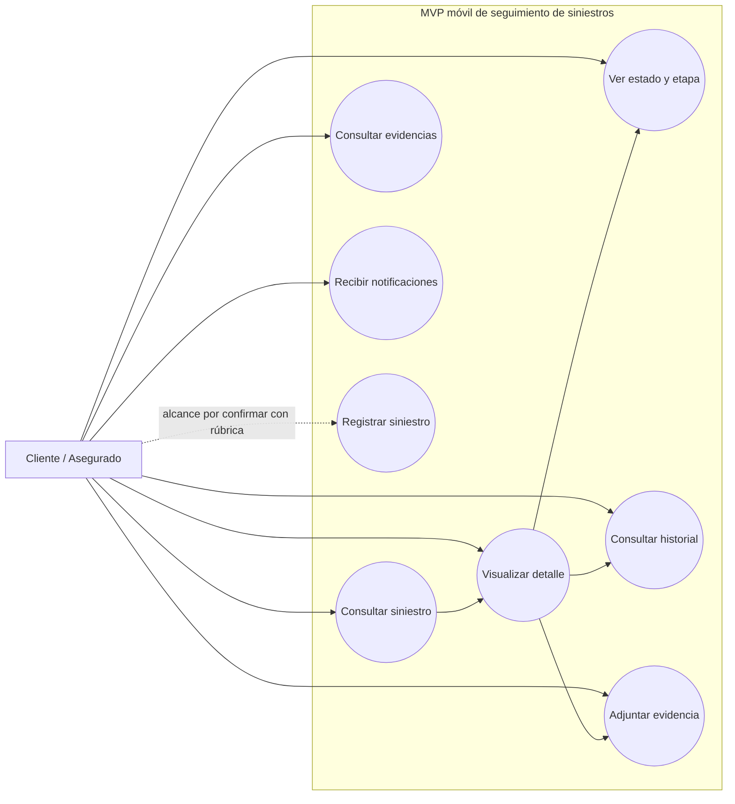
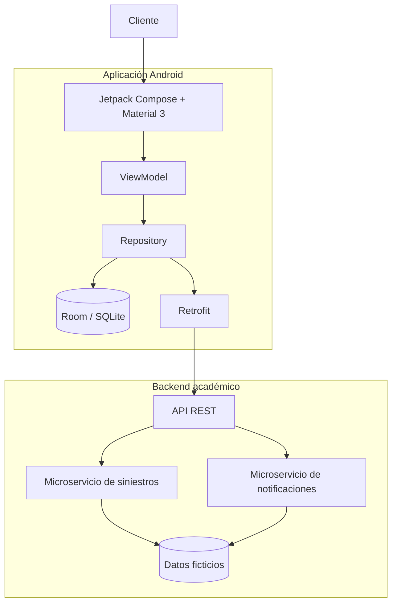
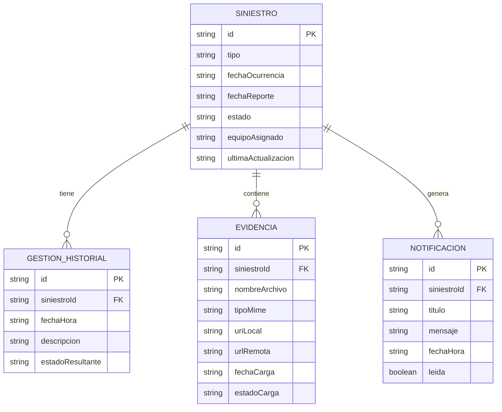
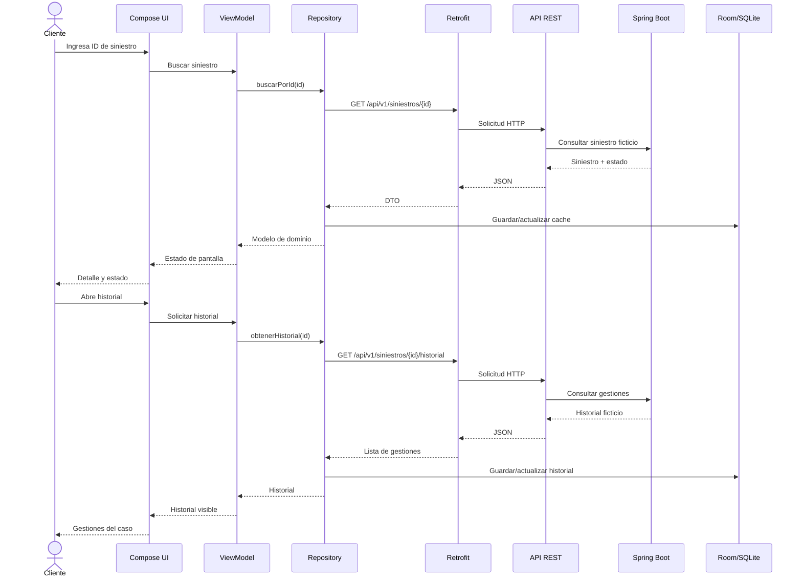

# Documentación

## Proyecto

**Asignatura:** DSY1105 Desarrollo de Aplicaciones Móviles  
**Proyecto:** Seguimiento móvil del estado de siniestros para clientes de servicios BPO  
**Organización del caso:** Servicios Corporativos Andes SpA  
**Tipo de solución:** MVP académico Android  
**Documento base:** Caso oficial DSY1105  
**Estado:** Documento vivo y fuente oficial del proyecto

---

# 1. Propósito

Este documento es la **fuente oficial de verdad del proyecto** dentro del repositorio GitHub.

Reúne los requerimientos funcionales y no funcionales del sistema, las decisiones relevantes de alcance y el estado real de implementación.

Cuando un cambio afecte alguno de estos elementos, este archivo debe actualizarse junto con el desarrollo:

- alcance del MVP,
- requerimientos funcionales,
- requerimientos no funcionales,
- arquitectura,
- tecnologías,
- modelos de datos,
- pantallas y navegación,
- API,
- persistencia,
- integraciones,
- pruebas,
- decisiones técnicas importantes,
- estado de implementación.

Los documentos ubicados en la carpeta `docs/` son complementarios. Si existiera una contradicción entre un documento complementario y este archivo, se debe revisar y corregir la inconsistencia para que `DOCUMENTACION.md` represente el estado vigente del proyecto.

GitHub es el lugar oficial donde se mantiene esta documentación versionada. Herramientas de comunicación como Discord pueden utilizarse para coordinación, avisos o conversación del equipo, pero no reemplazan la documentación del repositorio.

## 1.1 Regla de actualización

El flujo de trabajo será:

```text
Cambio de código, alcance o decisión
        ↓
Revisar impacto documental
        ↓
Actualizar DOCUMENTACION.md si corresponde
        ↓
Pull Request
        ↓
Revisión
        ↓
develop
```

Una tarea que cambie de forma relevante el sistema no se considera completamente cerrada si la documentación correspondiente quedó desactualizada.

## 1.2 Clasificación del origen

Se distinguen los siguientes tipos de origen:

- **Caso oficial:** aparece de forma explícita en el caso DSY1105.
- **Derivado del caso:** se incorpora porque es necesario para implementar correctamente una tarea descrita en el caso.
- **Rúbrica:** requisito o ajuste definido por la pauta oficial cuando esté disponible.
- **Decisión técnica:** elección del equipo para implementar el sistema sin alterar el objetivo del caso.

Los requerimientos describen el objetivo final del MVP. Que un requisito aparezca en este documento no significa necesariamente que ya esté implementado.

## 1.3 Base canónica actual

Desde el **2 de octubre de 2026**, la base oficial de desarrollo es el proyecto Android Studio **SeguimientoSiniestros** entregado por el equipo y subido al repositorio.

Configuración base:

- nombre del proyecto: `SeguimientoSiniestros`,
- package/applicationId: `com.example.seguimientosiniestros`,
- Minimum SDK: API 24,
- Target SDK: 36,
- Jetpack Compose,
- Material Design 3,
- Kotlin,
- Kotlin DSL,
- Gradle Wrapper 9.4.1.

La base parte desde una **Empty Activity** y será desarrollada desde este punto siguiendo las tareas vigentes en Trello.

Las implementaciones funcionales anteriores permanecen disponibles en el historial Git, pero **ya no representan el estado actual del código**. Las funcionalidades de consulta, detalle, seguimiento, historial, MVVM, navegación y modelos deberán reimplementarse sobre esta base cuando corresponda según el sprint.

## 1.4 Referencia de trabajo utilizada en clases

El repositorio conserva el proyecto **Miregistro** como referencia académica en `referencias/profesor/Miregistro/`.

Esta referencia se utilizará para observar la forma de organización mostrada en clases, especialmente:

- separación de `ui/theme`, `ui/styles` y `ui/components`,
- dimensiones y estilos reutilizables,
- recursos gráficos y strings,
- uso de Jetpack Compose y Material Design 3,
- estructura general de un proyecto Android Studio.

La referencia **no define requerimientos funcionales del proyecto de siniestros**. Ante cualquier diferencia, la prioridad continúa siendo: pauta/rúbrica oficial, caso DSY1105 y esta documentación vigente.

## 1.5 Política de calidad y pruebas

El repositorio adopta una política de QA basada en la utilizada en RecepVoz, adaptada al alcance académico y al stack Android + Spring Boot.

Las reglas completas están en:

- `AGENTS.md`,
- `docs/engineering/QA_POLICY.md`,
- `docs/engineering/DEFINITION_OF_DONE.md`.

Principios obligatorios:

- clasificar los cambios como LOW, MEDIUM o HIGH;
- usar RED → GREEN cuando corresponda;
- probar cada comportamiento en el nivel más bajo que realmente lo demuestre;
- ejecutar Room en emulador cuando se pruebe persistencia Android;
- usar pruebas de contrato para Retrofit;
- probar Spring Boot y sus endpoints cuando exista backend;
- mantener E2E para el happy path principal;
- no fusionar PR con Quality Gate rojo;
- certificar siempre el HEAD exacto;
- cobertura diferencial obligatoria de 100% en líneas y 100% en ramas cuando existan ramas;
- para lógica HIGH nueva o modificada, además mantener 100% de métodos significativos cuando corresponda, sin agregar pruebas artificiales.

La cobertura se utiliza como señal de zonas sin protección, no como sustituto de pruebas correctas.

---

# 2. Descripción general

El proyecto busca resolver la falta de visibilidad del cliente sobre el estado de su siniestro y reducir la dependencia de canales manuales como teléfono, correo u oficina.

La solución consiste en un MVP móvil Android que permita al cliente consultar y hacer seguimiento de un siniestro, revisar su estado e historial, adjuntar evidencia y recibir notificaciones ante cambios relevantes.

El sistema trabajará únicamente con datos ficticios, sintéticos o anonimizados.

---

# 3. Requerimientos funcionales

Los requerimientos funcionales representan acciones o comportamientos que el sistema debe ofrecer al usuario.

## RF-01. Consultar un siniestro

**Origen:** Caso oficial  
**Estado actual:** Implementado para el happy path actual.

El sistema permite que el cliente consulte un siniestro utilizando un identificador ficticio. El flujo vigente usa Retrofit contra el backend Spring Boot real, persiste/cachea la respuesta en Room y presenta el resultado mediante ViewModel + Compose.

### Criterios de aceptación

- El usuario puede ingresar un identificador.
- El sistema busca el siniestro correspondiente.
- Si existe, muestra su información.
- Si no existe, informa el resultado de forma clara.

---

## RF-02. Registrar un siniestro

**Origen:** Caso oficial, alcance exacto pendiente de rúbrica.  
**Estado actual:** Pendiente.

El caso establece que las tareas del cliente consideran **registrar o consultar un siniestro**.

Por esta razón, el proyecto contempla el registro de un siniestro como parte del alcance posible, pero no se asumirá un flujo de registro completo hasta revisar la rúbrica oficial.

En caso de implementarse, utilizará únicamente información ficticia como:

- tipo de siniestro,
- fecha de ocurrencia,
- fecha de reporte,
- identificador ficticio.

---

## RF-03. Visualizar el detalle del siniestro

**Origen:** Derivado del caso.  
**Estado actual:** Implementado para el happy path actual.

Una vez consultado un siniestro, el sistema presenta la información necesaria para comprender el caso.

La información considerada es:

- identificador,
- tipo de siniestro,
- fecha de ocurrencia,
- fecha de reporte,
- estado actual,
- equipo o colaborador asignado de forma referencial,
- última actualización cuando esté disponible.

---

## RF-04. Visualizar el estado y la etapa del siniestro

**Origen:** Caso oficial.  
**Estado actual:** Implementado para el happy path actual.

El sistema permite que el cliente identifique claramente el estado actual de su siniestro.

Los estados definidos por el caso son:

1. Recibido.
2. En evaluación.
3. En liquidación.
4. Cerrado.

---

## RF-05. Consultar el historial de gestiones

**Origen:** Caso oficial.  
**Estado actual:** Implementado para el happy path actual.

El sistema permite revisar el historial de gestiones realizadas sobre el siniestro.

Cada gestión puede mostrar:

- fecha y hora,
- descripción,
- estado resultante.

El historial debe mostrarse de manera ordenada y comprensible.

---

## RF-06. Adjuntar evidencia o documentación

**Origen:** Caso oficial.  
**Estado actual:** Pendiente.

El cliente debe poder adjuntar evidencia o documentación de respaldo asociada a su siniestro.

La solución debe contemplar:

- imágenes,
- documentos PDF sintéticos,
- uso de cámara cuando corresponda.

No se utilizarán archivos personales reales durante el desarrollo, las pruebas ni la demostración.

---

## RF-07. Consultar las evidencias asociadas

**Origen:** Derivado del caso.  
**Estado actual:** Pendiente.

Para permitir una experiencia coherente después de adjuntar documentación, el sistema podrá mostrar las evidencias asociadas al siniestro.

Este requerimiento es derivado. El caso exige explícitamente adjuntar evidencia, pero no define una pantalla independiente de consulta de evidencias.

---

## RF-08. Recibir notificaciones ante cambios relevantes

**Origen:** Caso oficial.  
**Estado actual:** Pendiente.

El sistema debe informar al cliente cuando exista un cambio relevante en su siniestro.

Las notificaciones deben quedar relacionadas con el caso correspondiente.

El caso indica que debe considerarse el envío de notificaciones push ante cambios de estado. La implementación exacta de push se confirmará con la rúbrica oficial.

---

## RF-09. Reflejar cambios de estado en el seguimiento

**Origen:** Derivado del caso.  
**Estado actual:** Pendiente de integración con backend.

Cuando el estado de un siniestro cambie, la aplicación debe reflejar la nueva etapa y mantener la trazabilidad visible para el cliente.

La actualización debe quedar representada en el seguimiento y, cuando corresponda, en el historial y las notificaciones.

---

# 4. Requerimientos no funcionales

Los requerimientos no funcionales corresponden a restricciones técnicas, condiciones de calidad y características obligatorias de la solución.

## RNF-01. Plataforma Android

**Origen:** Caso oficial  
**Estado actual:** Cumplido.

La aplicación móvil debe estar orientada a teléfonos Android.

---

## RNF-02. Kotlin

**Origen:** Caso oficial  
**Estado actual:** Cumplido.

El frontend móvil debe desarrollarse utilizando Kotlin.

---

## RNF-03. Android Studio

**Origen:** Caso oficial  
**Estado actual:** Requisito de entorno del proyecto.

El proyecto debe ser compatible con el desarrollo y ejecución mediante Android Studio.

---

## RNF-04. Jetpack Compose

**Origen:** Caso oficial  
**Estado actual:** Cumplido.

La interfaz de usuario debe implementarse utilizando Jetpack Compose.

---

## RNF-05. Material Design 3

**Origen:** Caso oficial  
**Estado actual:** Cumplido.

La interfaz debe utilizar Material Design 3.

---

## RNF-06. Arquitectura MVVM

**Origen:** Caso oficial  
**Estado actual:** Cumplido para el flujo actual.

La aplicación debe utilizar arquitectura MVVM para mantener separadas la interfaz, el estado y la lógica de presentación.

La estructura MVVM ya conecta las pantallas de Detalle, Seguimiento e Historial con `MainViewModel` y con `SiniestroRepository`. El ViewModel trabaja contra el contrato de Repository y no conoce Room ni sus DAO directamente.

---

## RNF-07. Persistencia local con Room/SQLite

**Origen:** Caso oficial  
**Estado actual:** Cumplido para el flujo actual.

El frontend móvil debe utilizar Room/SQLite para la persistencia local requerida por el MVP.

La base incorpora Room 2.8.5, las entidades locales `SiniestroEntity` y `GestionHistorialEntity`, relación mediante `siniestroId`, mappers, DAO, `AppDatabase`, `LocalSiniestroDataSource` y `LocalSiniestroRepository`. La aplicación ya guarda y consulta siniestros e historial a través del Repository. GitHub Actions ejecuta las pruebas instrumentadas dentro de un emulador Android, por lo que la validación de Room y Repository se realiza en runtime Android.

La interfaz de usuario no accede directamente a Room.

---

## RNF-08. Integración mediante Retrofit

**Origen:** Caso oficial  
**Estado actual:** Cumplido para consulta e historial.

La aplicación Android incorpora Retrofit y converter Gson, DTOs para siniestro e historial, `SiniestroApiService` y un `RetrofitProvider` reutilizable.

El contrato remoto implementado actualmente cubre:

- `GET /api/v1/siniestros/{id}`,
- `GET /api/v1/siniestros/{id}/historial`.

La URL base académica para emulador es `http://10.0.2.2:8080/api/v1/`, donde `10.0.2.2` representa el host del computador desde el emulador Android.

A5 ya incorpora `RemoteSiniestroDataSource`, mappers DTO → dominio y `RemoteFirstSiniestroRepository`. La estrategia es remoto primero y Room como cache/fallback ante problemas de conectividad. `MainViewModel` consulta únicamente el contrato `SiniestroRepository`, por lo que no conoce Retrofit ni Room directamente.

La integración Android mantiene pruebas de contrato con MockWebServer y, además, ya fue validada de punta a punta contra el Spring Boot real del repositorio. El E2E ejecuta Android → Retrofit → Spring Boot → Repository → Room → ViewModel → Compose y comprueba Detalle e Historial.

Las llamadas remotas se mantienen fuera de la capa de interfaz.

---

## RNF-09. Backend Spring Boot

**Origen:** Caso oficial  
**Estado actual:** Implementado para el MVP actual.

El repositorio contiene un backend Spring Boot mínimo en `backend/`, con capas Controller, Service y Repository en memoria para datos ficticios. Expone el flujo necesario de consulta e historial y puede levantarse en CI para la prueba E2E real.

---

## RNF-10. API REST

**Origen:** Caso oficial  
**Estado actual:** Implementado para consulta e historial.

El backend expone actualmente:

- `GET /api/v1/health`,
- `GET /api/v1/siniestros/{id}`,
- `GET /api/v1/siniestros/{id}/historial`.

Los endpoints de evidencias, notificaciones, registro y cambio de estado siguen pendientes hasta que esos flujos se implementen.

---

## RNF-11. Microservicios

**Origen:** Caso oficial  
**Estado actual:** Parcial; todavía no cumplido completamente.

Actualmente existe **un solo servicio Spring Boot** que concentra consulta e historial. Esto permite respaldar el MVP y validar la integración real, pero todavía no demuestra una arquitectura de microservicios completa.

Si la pauta exige separación física de servicios, deberá incorporarse al menos un segundo servicio con una responsabilidad real, por ejemplo notificaciones, evitando dividir artificialmente el backend solo para cumplir el nombre del patrón.

---

## RNF-12. Pruebas unitarias del backend

**Origen:** Caso oficial  
**Estado actual:** Implementado para el backend actual.

El backend cuenta con pruebas automatizadas mediante Spring Boot + MockMvc que cubren consulta válida, recurso inexistente, historial ordenado y 404 de historial inexistente. El workflow `backend-ci.yml` ejecuta pruebas, genera reporte JaCoCo y empaqueta el backend.

---

## RNF-13. Usabilidad

**Origen:** Caso oficial  
**Estado actual:** En aplicación continua durante el desarrollo.

La experiencia debe considerar usuarios de distintas edades y distintos niveles de familiaridad tecnológica.

La aplicación debe ser:

- simple,
- clara,
- comprensible,
- de bajo esfuerzo cognitivo.

---

## RNF-14. Privacidad y protección de datos

**Origen:** Caso oficial  
**Estado actual:** Cumplido en los datos actuales del proyecto.

No se utilizarán datos personales reales de asegurados.

Tampoco se utilizarán:

- pólizas reales,
- información médica real,
- información financiera real,
- credenciales reales,
- accesos a sistemas internos.

---

## RNF-15. Seguridad

**Origen:** Caso oficial  
**Estado actual:** Requisito transversal.

La solución debe considerar buenas prácticas de seguridad y protección de datos personales.

---

## RNF-16. Datos ficticios, sintéticos o anonimizados

**Origen:** Caso oficial  
**Estado actual:** Cumplido.

Todos los datos utilizados para desarrollo, pruebas y demostración deben ser ficticios, sintéticos o anonimizados.

---

## RNF-17. Sin integración productiva con sistemas core

**Origen:** Caso oficial  
**Estado actual:** Cumplido.

El MVP no debe implementar integración productiva con sistemas core de pólizas ni con otros sistemas internos de aseguradoras.

La información externa será simulada mediante los componentes académicos desarrollados para el proyecto.

---

## RNF-18. Sin login real

**Origen:** Caso oficial  
**Estado actual:** Cumplido.

No se debe desarrollar un sistema de autenticación real para este MVP académico.

---

## RNF-19. Enfoque en happy path

**Origen:** Caso oficial  
**Estado actual:** Cumplido en la planificación actual.

El proyecto no necesita desarrollar todas las vistas ni todos los flujos excepcionales.

El desarrollo debe concentrarse primero en el recorrido principal necesario para demostrar la solución.

---

# 5. Matriz resumida de requerimientos

| Código | Requerimiento | Origen | Estado actual |
|---|---|---|---|
| RF-01 | Consultar siniestro | Caso oficial | Implementado |
| RF-02 | Registrar siniestro | Caso oficial, alcance a confirmar | Pendiente |
| RF-03 | Visualizar detalle | Derivado | Implementado |
| RF-04 | Visualizar estado y etapa | Caso oficial | Implementado |
| RF-05 | Consultar historial | Caso oficial | Implementado |
| RF-06 | Adjuntar evidencia/documentación | Caso oficial | Pendiente |
| RF-07 | Consultar evidencias | Derivado | Pendiente |
| RF-08 | Recibir notificaciones | Caso oficial | Pendiente |
| RF-09 | Reflejar cambios de estado | Derivado | Pendiente |
| RNF-01 | Android | Caso oficial | Cumplido |
| RNF-02 | Kotlin | Caso oficial | Cumplido |
| RNF-03 | Android Studio | Caso oficial | Requisito de entorno |
| RNF-04 | Jetpack Compose | Caso oficial | Cumplido |
| RNF-05 | Material Design 3 | Caso oficial | Cumplido |
| RNF-06 | MVVM | Caso oficial | Cumplido |
| RNF-07 | Room/SQLite | Caso oficial | Cumplido para el flujo actual |
| RNF-08 | Retrofit | Caso oficial | Cumplido: consulta e historial |
| RNF-09 | Spring Boot | Caso oficial | Cumplido para el MVP actual |
| RNF-10 | API REST | Caso oficial | Cumplido: consulta e historial |
| RNF-11 | Microservicios | Caso oficial | Parcial; falta separación real en más de un servicio |
| RNF-12 | Pruebas unitarias backend | Caso oficial | Implementado para el backend actual |
| RNF-13 | Usabilidad | Caso oficial | En progreso |
| RNF-14 | Privacidad | Caso oficial | Cumplido actualmente |
| RNF-15 | Seguridad | Caso oficial | Transversal |
| RNF-16 | Datos ficticios | Caso oficial | Cumplido |
| RNF-17 | Sin integración core productiva | Caso oficial | Cumplido |
| RNF-18 | Sin login real | Caso oficial | Cumplido |
| RNF-19 | Happy path | Caso oficial | Cumplido |

---

# 6. Estado actual de implementación

## 6.1 Base implementada

Actualmente el repositorio contiene la nueva base canónica Android Studio:

- proyecto `SeguimientoSiniestros`,
- package `com.example.seguimientosiniestros`,
- Minimum SDK 24,
- Target SDK 36,
- Kotlin,
- Jetpack Compose,
- Material Design 3,
- tema Compose inicial,
- `MainActivity` generada como Empty Activity,
- Gradle Wrapper,
- pruebas de ejemplo generadas por Android Studio,
- CI preparado para compilar el APK, ejecutar pruebas unitarias y levantar un emulador Android para ejecutar `connectedDebugAndroidTest`,
- modelos de dominio `Siniestro`, `GestionHistorial`, `Evidencia` y `Notificacion`,
- enum `EstadoSiniestro` con los cuatro estados definidos por el caso,
- contrato `SiniestroRepository`,
- `MainUiState` y `MainViewModel` como base de presentación MVVM,
- navegación Compose con rutas para Inicio, Consulta, Detalle, Seguimiento, Historial, Evidencias y Notificaciones,
- pantallas base navegables para el happy path,
- sistema visual Compose reutilizable con `Dimens`, estilos de botones, campos y tarjetas,
- componentes compartidos `PantallaBase`, `BotonPrincipal`, `TarjetaInformativa` y `EstadoSiniestroChip`,
- tema visual propio aplicado a las pantallas base,
- Room configurado con entidades locales para siniestro e historial,
- mappers dominio ↔ entidad para mantener separadas las capas,
- DAO para guardar/actualizar y consultar siniestros,
- DAO de historial con consulta ordenada por fecha descendente,
- `AppDatabase` como base Room de la aplicación,
- `LocalSiniestroDataSource` y `LocalSiniestroRepository` como acceso local desacoplado de la UI,
- `MainViewModel` conectado al Repository sin dependencia directa de Room,
- dataset académico ficticio `SIN-2026-001` para demostrar el flujo local,
- Detalle, Seguimiento e Historial leyendo el estado local desde el ViewModel,
- pruebas instrumentadas con base en memoria para validar persistencia desde DAO y Repository,
- ejecución real de la suite instrumentada en emulador Android API 35 desde GitHub Actions,
- Retrofit + Gson configurados para el contrato REST académico,
- `SiniestroDto`, `GestionHistorialDto`, `SiniestroApiService` y `RetrofitProvider`,
- `RemoteSiniestroDataSource` y mappers DTO → dominio,
- `RemoteFirstSiniestroRepository` con persistencia de respuestas remotas en Room y fallback local ante errores de conectividad,
- `RepositoryProvider` configurado para entregar el Repository remoto/local al ViewModel,
- `MainViewModel` con estados loading/error para la consulta remota,
- cleartext HTTP habilitado únicamente en build debug para permitir la conexión académica al host local desde el emulador,
- pruebas unitarias con MockWebServer que validan rutas y deserialización del contrato REST,
- prueba instrumentada que valida respuesta remota → dominio → cache Room,
- pruebas unitarias de estados oficiales, construcción de rutas, orden de etapas y mapeo de entidades,
- backend Spring Boot mínimo en `backend/` con endpoints reales de consulta, historial y health,
- pruebas automatizadas de backend con MockMvc y workflow dedicado,
- E2E instrumentado contra Spring Boot real que valida Android → Retrofit → Spring Boot → Repository → Room → ViewModel → Compose → Detalle → Historial.

La aplicación ya inicia en una navegación Compose básica y las pantallas comparten un sistema visual reutilizable. El flujo Consulta → Detalle → Seguimiento/Historial está conectado a un Repository remoto primero: obtiene siniestro e historial mediante Retrofit desde Spring Boot, actualiza Room como cache y puede usar datos locales cuando la red no está disponible. El happy path de consulta e historial ya fue demostrado de punta a punta en CI.

## 6.2 Pendiente de reimplementación y desarrollo

A partir de esta base falta implementar:

- completar el requisito de microservicios si la pauta exige más de un servicio real,
- formulario de consulta con validación visual por campo implementado; los formularios que se agreguen en evidencias deberán mantener el mismo criterio,
- validación del identificador centralizada en `ConsultaSiniestroValidator`; las próximas reglas reutilizables deberán mantenerse fuera de los Composables,
- evidencias con imágenes/PDF/cámara,
- notificaciones,
- actualización remota de estados,
- endpoints REST asociados a los flujos que todavía no existen,
- definición final del registro de siniestro según la rúbrica.

Las tareas de implementación deben seguir el orden y los responsables definidos en Trello.

---

# 7. Relación con el problema del caso

La funcionalidad priorizada responde directamente al problema principal del caso: el cliente necesita conocer el estado de su siniestro sin depender de teléfono, correo u oficina.

El MVP debe contribuir a:

- dar mayor visibilidad del estado del caso,
- mejorar la trazabilidad percibida,
- facilitar el acceso a la información,
- reducir la dependencia de canales manuales,
- ofrecer una experiencia simple durante un proceso potencialmente estresante.

---

# 8. Fuera de alcance

El proyecto no contempla:

- login productivo,
- sistemas core reales de pólizas,
- información personal real,
- información médica o financiera real,
- credenciales reales,
- integración productiva con aseguradoras,
- implementación productiva de módulos internos de normalización o distribución,
- publicación productiva de la aplicación,
- cobertura completa de todos los flujos excepcionales.

---

# 9. Regla de alcance

Antes de incorporar una nueva funcionalidad se debe comprobar que:

1. la solicite el caso o la rúbrica,
2. aporte al happy path,
3. pueda demostrarse,
4. pueda probarse,
5. no agregue complejidad innecesaria.

Cuando esté disponible, la rúbrica oficial tendrá prioridad para definir el alcance final del proyecto.


---

# 10. Plan acelerado de sprints hasta la entrega

El plazo del proyecto se redujo a aproximadamente **una semana y media**. La planificación se organiza con trabajo paralelo y tareas pequeñas.

Mientras no exista una fecha oficial exacta, se utilizará como ventana interna tentativa el período **28 de septiembre al 7 de octubre de 2026**.

La prioridad es completar primero lo obligatorio del caso y evitar funcionalidades que no aporten al MVP o a la rúbrica.

## 10.0 Responsables asignados

- **Nicolás Iván Vega Linero:** GitHub `@Nicricht`, Trello `@nicolasivanvegalinero`. Lleva la ruta crítica: Room, Retrofit, backend mínimo de respaldo, integración, formularios/validaciones y evidencias.
- **Colaborador del repositorio:** bloque técnico real pero no bloqueante: estados UI (loading/error/vacío/confirmaciones), animaciones Compose y pulido Material 3; después podrá apoyar UI tests/notificaciones UI.
- **Ambos:** auditoría final criterio por criterio, privacidad/seguridad, validación de entrega, documentación de cierre y release.

## Sprint 0 · Documentación inicial

**Estado:** Completado.

Incluyó visión, alcance, requerimientos, arquitectura inicial, modelo de datos, contrato API, casos de uso, decisiones técnicas, mockups, GitFlow y documentación oficial.

## Sprint 1 · Base Android

**Estado histórico:** Completado en una implementación anterior.

El **2 de octubre de 2026** el equipo decidió reemplazar esa implementación por la nueva base canónica `SeguimientoSiniestros`. La experiencia previa se conserva en Git, pero el desarrollo vigente parte desde la nueva Empty Activity.

## Sprint 2 · Consulta y seguimiento local

**Estado histórico:** Completado en una implementación anterior.

La implementación previa de consulta y seguimiento quedó preservada en el historial Git, pero no forma parte de la nueva base actual. Las funcionalidades se reimplementarán según las tareas vigentes del Sprint 3.

## Sprint 3 · Room + Backend + Retrofit + Integración + Evidencias

**Ventana:** 28 de septiembre al 4 de octubre de 2026.  
**Estado:** Sprint actual.

Este sprint corresponde a la **unión de los antiguos Sprint 3 y Sprint 4**.

### Nicolás Iván Vega Linero

1. **A0.1 · Estructura MVVM y modelos de dominio** ✅
2. **A0.2 · Navegación y pantallas base** ✅
3. **A0.3 · Sistema visual reutilizable Compose** ✅
4. **A1 · Room: dependencias y entidades** ✅
5. **A2 · Room: DAO y base de datos** ✅
6. **A3 · Room: repositorio local y pruebas** ✅
7. **A4 · Retrofit: configuración, DTOs y ApiService** ✅
8. **A5 · Retrofit: repositorio remoto + ViewModel** ✅ validado contra Spring Boot real en E2E

### Backend de respaldo e integración

El bloque B1-B4 dejó de depender del colaborador y fue cubierto en la ruta crítica de Nicolás para evitar bloquear la entrega:

1. **Spring Boot base** ✅
2. **Endpoint de consulta** ✅
3. **Endpoint de historial** ✅
4. **Pruebas backend + CI** ✅

### Integraciones compartidas

1. **I1 · Integrar estado e historial con backend** — revisar criterio exacto en Trello antes de cerrar.
2. **I2 · Integrar Room + API** — revisar criterio exacto en Trello antes de cerrar.
3. **I3 · Prueba E2E consulta → historial** — evidencia técnica existente; revisar criterio exacto en Trello antes de cerrar.

### Criterio de cierre del Sprint 3

El Sprint 3 se considera terminado cuando:

- la nueva base cuenta con estructura MVVM, modelos, navegación y pantallas base,
- existe un sistema visual Compose reutilizable coherente con el trabajo desarrollado en clases,
- Room/SQLite funciona desde Repository,
- Spring Boot y los endpoints REST funcionan,
- Retrofit conecta Android con el backend,
- consulta, detalle, estado e historial funcionan de punta a punta,
- Room actúa como persistencia/cache simple,
- evidencia básica con imagen/PDF/cámara está disponible,
- pruebas principales pasan,
- `DOCUMENTACION.md` coincide con lo implementado.

**Fecha límite interna del Sprint 3: 4 de octubre de 2026.**

## Sprint 4 · Notificaciones + UI + calidad + pruebas

**Ventana:** 5 y 6 de octubre de 2026.

### Nicolás Iván Vega Linero

- cambio simulado de estado,
- generación de notificación,
- actualización del seguimiento.

### Colaborador del repositorio

- estados UI loading/error/vacío y confirmaciones,
- animaciones Compose,
- pulido y consistencia Material Design 3,
- después UI tests/notificaciones UI si el tiempo y la pauta lo requieren.

### Ambos

- revisión de privacidad y seguridad,
- pruebas Android + backend,
- verificación de datos ficticios,
- corrección de errores críticos.

### Registro de siniestro

El registro continúa como **tarea condicional**. Solo se implementará si la rúbrica confirma que debe desarrollarse además de la consulta.

## Sprint 5 · Cierre y entrega

**Ventana:** 7 de octubre de 2026.

Responsabilidad compartida.

Tareas:

- validar happy path completo,
- corregir errores críticos,
- actualizar `DOCUMENTACION.md`,
- revisar diagramas,
- preparar demostración,
- verificar README y enlaces,
- comprobar CI,
- preparar `release/*`,
- fusionar a `main` solo cuando `develop` esté estable.

## 10.1 Regla para el plazo reducido

El trabajo debe avanzar en paralelo:

```text
Nicolás ───── Room ── Retrofit ── Notificaciones ──┐
                                                   ├── Integración y entrega
Colaborador ── Backend ── Evidencias ── UI/UX ─────┘
```

Cada tarea debe ser suficientemente pequeña para poder completarse, probarse y fusionarse rápidamente.

## 10.2 Regla para trabajo en pareja

Cada tarea técnica debe definir sprint, responsable, rama Git, objetivo, subtareas, criterios de aceptación, pruebas necesarias e impacto en `DOCUMENTACION.md`.

El flujo sigue siendo:

```text
Tarea Trello
   ↓
rama feature/*, test/* o docs/*
   ↓
desarrollo
   ↓
pruebas
   ↓
actualizar DOCUMENTACION.md
   ↓
Pull Request
   ↓
develop
```

No se trabaja directamente sobre `main`.

# 11. Diagramas esenciales

Estos diagramas representan el alcance funcional y la arquitectura objetivo del MVP. Los componentes marcados como pendientes forman parte de los siguientes sprints y no deben interpretarse como ya implementados.

## 11.1 Diagrama de casos de uso

El actor principal del MVP móvil es el **cliente o asegurado**. El colaborador o liquidador y el equipo de administración forman parte del contexto del proceso, pero no requieren una aplicación administrativa completa dentro del alcance actual.



**Estado actual:** consulta, detalle, estado e historial ya funcionan con datos ficticios obtenidos desde el backend Spring Boot real y cacheados en Room. Evidencias y notificaciones están pendientes. El registro queda sujeto a la revisión de la rúbrica.

## 11.2 Diagrama de arquitectura general

La arquitectura objetivo respeta las tecnologías exigidas por el caso: Android con Kotlin, Compose, Material 3 y MVVM; persistencia local con Room/SQLite; integración mediante Retrofit; y backend con Spring Boot, API REST y microservicios.



**Estado actual de la arquitectura:**

- **Implementado:** UI Compose, Material 3, ViewModel, Repository, modelos de dominio, Room/SQLite, Retrofit, backend Spring Boot mínimo, API REST de consulta/historial y E2E real.
- **Pendiente:** evidencias, notificaciones, actualización remota de estado y, si la pauta lo exige literalmente, separar responsabilidades en más de un microservicio real.

## 11.3 Diagrama del modelo de datos

El modelo se mantiene limitado a la información necesaria para el caso académico y utiliza únicamente información ficticia.



Los valores permitidos para el estado del siniestro son:

```text
RECIBIDO
EN_EVALUACION
EN_LIQUIDACION
CERRADO
```

## 11.4 Diagrama de secuencia de consulta

El siguiente diagrama representa el flujo actual de consulta e historial. Este recorrido ya fue validado con una prueba E2E instrumentada contra Spring Boot real; MockWebServer se mantiene para pruebas de contrato aisladas de Retrofit, pero no sustituye esta validación de punta a punta.



## 11.5 Regla de mantenimiento de diagramas

Los diagramas forman parte de la documentación viva. Si cambia la arquitectura, el modelo de datos, los actores, el flujo de consulta o las responsabilidades de los componentes, estos diagramas deben actualizarse en el mismo ciclo de trabajo.
