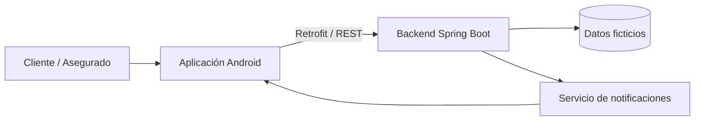
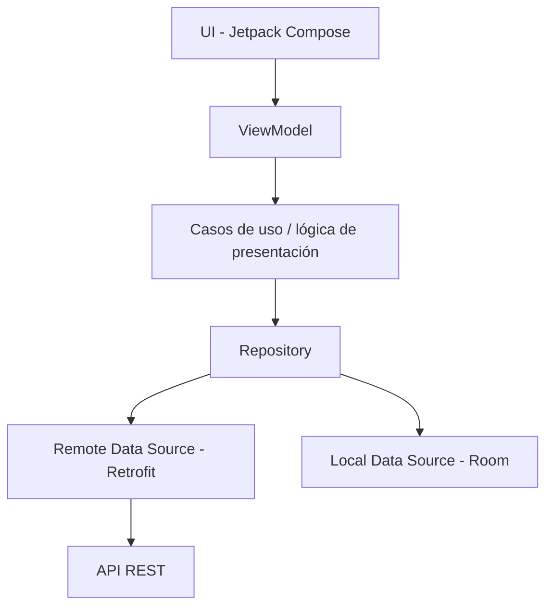
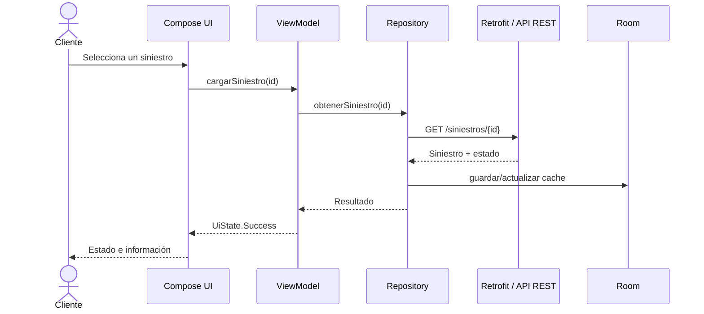

# Arquitectura propuesta

## 1. Objetivo arquitectónico

Construir un MVP Android simple de demostrar, mantenible y alineado con las restricciones del caso: Kotlin, Jetpack Compose, Material Design 3, MVVM, Room/SQLite, Retrofit, Spring Boot, API REST, microservicios y pruebas unitarias.

## 2. Vista de contexto



El cliente interactúa únicamente con la aplicación Android. La app consulta al backend mediante API REST. La información del caso es ficticia o anonimizada.

## 3. Arquitectura de la aplicación Android

Se propone una arquitectura MVVM con separación por capas:



### Presentation

Responsabilidades:

- Pantallas Compose.
- Componentes Material Design 3.
- Navegación.
- Manejo de estados visuales.
- ViewModels.

### Domain

Para el MVP puede mantenerse liviano.

Responsabilidades propuestas:

- Consultar siniestro.
- Registrar siniestro.
- Obtener historial.
- Adjuntar evidencia.
- Consultar notificaciones.

### Data

Responsabilidades:

- Retrofit para API remota.
- Room para persistencia local.
- DTOs.
- Entidades Room.
- Mappers.
- Repositories.

## 4. Flujo de datos

Ejemplo al consultar un siniestro:



## 5. Microservicios propuestos

El documento exige microservicios Spring Boot, pero no define cuántos ni sus fronteras. Para mantener el MVP abordable se propone comenzar con dos servicios lógicos.

### siniestros-service

Responsable de:

- Registrar siniestros ficticios.
- Consultar un siniestro.
- Consultar historial.
- Gestionar estado.
- Asociar evidencia/documentación.

### notificaciones-service

Responsable de:

- Registrar eventos de notificación.
- Entregar notificaciones asociadas a un siniestro.
- Simular o disparar avisos por cambios relevantes.

> Si el equipo necesita simplificar todavía más, se puede mantener el mismo contrato lógico y desplegar ambos módulos en un entorno controlado de desarrollo. La entrega final debe seguir mostrando claramente la separación de responsabilidades.

## 6. Persistencia

### En Android

Room/SQLite se usará para:

- Cachear siniestros consultados.
- Mantener historial reciente.
- Mantener notificaciones visibles.
- Dar una experiencia tolerante a fallos de red básicos.

### En backend

El caso no fija una tecnología de base de datos específica para el backend.

Decisión pendiente:

- H2 para desarrollo y demostración.
- PostgreSQL si el equipo necesita una persistencia más cercana a un entorno real.

Esta decisión debe tomarse según la rúbrica y el tiempo disponible.

## 7. Notificaciones

El caso exige considerar notificaciones push ante cambios de estado.

Propuesta:

- Mantener un modelo de notificaciones dentro del backend.
- Exponerlas a la aplicación.
- Si la evaluación exige push real, integrar Firebase Cloud Messaging.
- Si no lo exige, demostrar el comportamiento mediante notificaciones simuladas dentro del MVP y documentar la extensión a push real.

## 8. Evidencias y documentos

El caso permite imágenes o PDF sintéticos.

Flujo propuesto:

1. Usuario selecciona cámara o archivo.
2. Android obtiene URI local.
3. Se valida el tipo de archivo.
4. Se envía al backend mediante Retrofit.
5. El backend registra metadatos de la evidencia.
6. La app refleja la evidencia en el detalle del siniestro.

## 9. Manejo de estados de UI

Cada pantalla que dependa de datos debe manejar al menos:

- Loading.
- Success.
- Empty.
- Error.

Aunque el caso prioriza happy path, esto evita una interfaz frágil y mantiene una estructura limpia.

## 10. Seguridad y privacidad

Aunque no habrá login real, el proyecto debe:

- No usar información real.
- No guardar credenciales reales.
- Evitar exponer datos sensibles en logs.
- Validar archivos y entradas.
- Usar identificadores ficticios.
- Mantener separación entre datos locales y remotos.

## 11. Estructura Android propuesta

```text
app/
└── src/main/java/.../
    ├── data/
    │   ├── local/
    │   ├── remote/
    │   ├── mapper/
    │   └── repository/
    ├── domain/
    │   ├── model/
    │   ├── repository/
    │   └── usecase/
    ├── ui/
    │   ├── navigation/
    │   ├── screens/
    │   ├── components/
    │   └── theme/
    └── MainActivity.kt
```

## 12. Estructura backend propuesta

```text
backend/
├── siniestros-service/
│   └── src/main/java/.../
│       ├── controller/
│       ├── service/
│       ├── repository/
│       ├── model/
│       ├── dto/
│       └── exception/
└── notificaciones-service/
    └── src/main/java/.../
        ├── controller/
        ├── service/
        ├── repository/
        ├── model/
        └── dto/
```

## 13. Decisiones que todavía no debemos cerrar

- Base de datos del backend.
- Push real versus simulación académica.
- Almacenamiento físico de imágenes/PDF.
- Si el registro de siniestro será completo o pre-cargado con datos ficticios.
- Estrategia final de despliegue.

Estas decisiones deben cerrarse después de revisar la rúbrica de evaluación.
