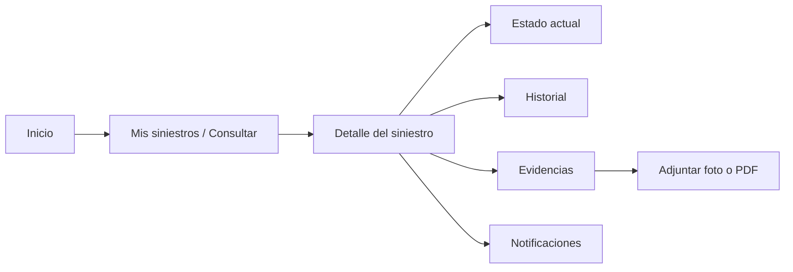
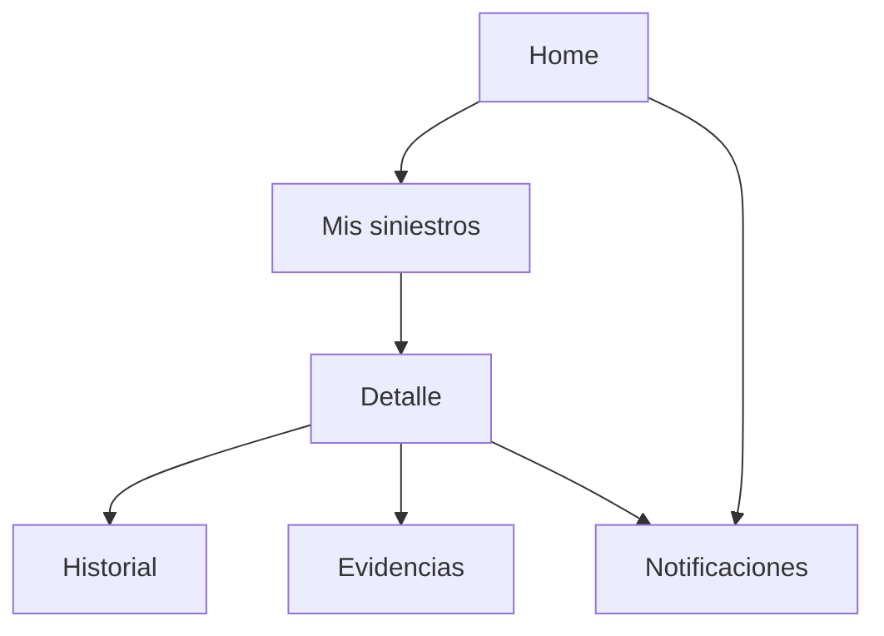

# Diseño funcional y UX

## 1. Objetivo de experiencia

La aplicación debe ser simple, clara y de bajo esfuerzo cognitivo. El usuario puede encontrarse en una situación estresante después de un siniestro, por lo que la interfaz no debe obligarlo a interpretar información técnica o navegar demasiados pasos.

## 2. Flujo principal



## 3. Pantallas propuestas

### 3.1 Inicio

Objetivo:

- Dar acceso inmediato al seguimiento del siniestro.

Contenido propuesto:

- Título de la aplicación.
- Acción principal: "Consultar siniestro".
- Acceso a "Mis siniestros" si se usan datos precargados.
- Acceso a notificaciones.

No se implementará login real porque el caso lo deja fuera del alcance.

### 3.2 Mis siniestros

Cada tarjeta puede mostrar:

- Identificador.
- Tipo de siniestro.
- Fecha de reporte.
- Estado actual.
- Última actualización.

Ejemplo:

```text
SIN-2026-001
Accidente vehicular
Estado: En evaluación
Última actualización: 24/09/2026
```

### 3.3 Detalle del siniestro

Debe concentrar la información principal:

- Identificador.
- Tipo.
- Fecha de ocurrencia.
- Fecha de reporte.
- Estado actual.
- Equipo o colaborador asignado, si corresponde.
- Acceso al historial.
- Acceso a evidencias.

### 3.4 Seguimiento de estado

Representación propuesta:

```text
Recibido ✓
   ↓
En evaluación ●
   ↓
En liquidación ○
   ↓
Cerrado ○
```

La intención es que el cliente entienda de inmediato en qué etapa se encuentra.

### 3.5 Historial

Listado cronológico de gestiones.

Ejemplo:

```text
24/09/2026
Caso asignado a equipo liquidador

22/09/2026
Documentación recibida

21/09/2026
Siniestro registrado
```

### 3.6 Evidencias

Debe permitir:

- Ver documentos asociados.
- Adjuntar imagen.
- Adjuntar PDF.
- Usar cámara cuando corresponda.

Cada evidencia puede mostrar:

- Nombre.
- Tipo.
- Fecha.
- Estado de carga.

### 3.7 Notificaciones

Lista simple de cambios relevantes.

Ejemplo:

```text
Tu siniestro SIN-2026-001 cambió a "En liquidación".
```

## 4. Navegación propuesta



## 5. Principios de diseño

### Claridad

- Lenguaje cotidiano.
- Evitar jerga de seguros cuando no sea necesaria.
- Estado siempre visible.

### Jerarquía

Primero mostrar:

1. Estado actual.
2. Última actualización.
3. Próximas acciones.
4. Historial detallado.

### Bajo esfuerzo cognitivo

- Pocas acciones por pantalla.
- Botones claramente nombrados.
- Evitar formularios extensos.
- Mantener consistencia visual.

### Accesibilidad

Propuesta:

- Tamaños de texto legibles.
- Contraste adecuado.
- Áreas táctiles suficientes.
- No depender únicamente del color para comunicar estados.
- Etiquetas claras para iconos.

## 6. Componentes Material 3 propuestos

- TopAppBar.
- Cards.
- Buttons.
- Chips para estados.
- Snackbar.
- CircularProgressIndicator.
- ModalBottomSheet para acciones de evidencia.
- NavigationBar o navegación simple según cantidad final de secciones.

## 7. Estados visuales

### Loading

Mostrar progreso mientras se obtiene información.

### Empty

Ejemplo:

"No hay historial disponible todavía."

### Error

Ejemplo:

"No pudimos actualizar el siniestro. Intenta nuevamente."

### Success

Mostrar contenido actualizado y fecha de última sincronización.

## 8. Happy path prioritario

El caso permite concentrarse en el happy path.

Flujo prioritario de demostración:

1. Abrir app.
2. Consultar un siniestro ficticio.
3. Ver detalle.
4. Entender el estado.
5. Abrir historial.
6. Adjuntar evidencia.
7. Simular cambio de estado.
8. Mostrar notificación.
9. Ver el nuevo estado actualizado.

Ese flujo debe funcionar antes de desarrollar extras.
