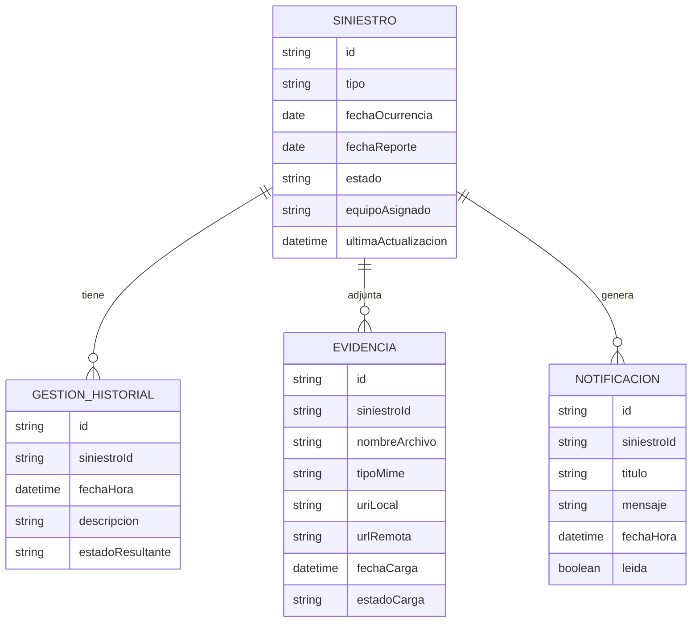

# Modelo de datos propuesto

## 1. Objetivo

Representar únicamente la información necesaria para demostrar el seguimiento móvil de un siniestro.

El caso identifica como información relevante:

- Identificador de siniestro.
- Tipo de siniestro.
- Fecha de ocurrencia.
- Fecha de reporte.
- Estado y etapa.
- Historial de gestiones.
- Evidencias o documentos.
- Equipo o colaborador asignado.
- Notificaciones.

## 2. Entidades principales

### Siniestro

Campos propuestos:

| Campo | Tipo conceptual | Origen |
|---|---|---|
| id | String | Requerido por el caso |
| tipo | String | Requerido por el caso |
| fechaOcurrencia | Fecha | Requerido por el caso |
| fechaReporte | Fecha | Requerido por el caso |
| estado | Enum | Requerido por el caso |
| equipoAsignado | String? | Requerido por el caso |
| ultimaActualizacion | FechaHora | Propuesto para UX |

Estados:

```text
RECIBIDO
EN_EVALUACION
EN_LIQUIDACION
CERRADO
```

### GestionHistorial

Campos propuestos:

| Campo | Tipo conceptual |
|---|---|
| id | String |
| siniestroId | String |
| fechaHora | FechaHora |
| descripcion | String |
| estadoResultante | EstadoSiniestro? |

### Evidencia

Campos propuestos:

| Campo | Tipo conceptual |
|---|---|
| id | String |
| siniestroId | String |
| nombreArchivo | String |
| tipoMime | String |
| uriLocal | String? |
| urlRemota | String? |
| fechaCarga | FechaHora |
| estadoCarga | Enum |

### Notificacion

Campos propuestos:

| Campo | Tipo conceptual |
|---|---|
| id | String |
| siniestroId | String |
| titulo | String |
| mensaje | String |
| fechaHora | FechaHora |
| leida | Boolean |

## 3. Relaciones



## 4. Room

**Estado actual:** implementación iniciada.

Implementado en A1:

- dependencia Room 2.8.5,
- `SiniestroEntity` para la tabla `siniestros`,
- `GestionHistorialEntity` para la tabla `historial`,
- clave primaria `id` en ambas entidades,
- clave foránea `GestionHistorialEntity.siniestroId → SiniestroEntity.id`,
- eliminación en cascada del historial cuando se elimine su siniestro,
- índice sobre `siniestroId`,
- mappers dominio ↔ entidad.

Implementado en A2:

- `SiniestroDao` con upsert y búsqueda por identificador,
- `GestionHistorialDao` con upsert individual/masivo,
- consulta de historial por `siniestroId` ordenada por `fechaHora DESC`,
- `AppDatabase` versión 1 con ambas entidades,
- instancia única de Room mediante `getInstance(context)`,
- prueba instrumentada con base en memoria para verificar guardado/recuperación de `SIN-2026-001` y orden de su historial.

Pendiente para las siguientes tareas:

- repositorio local,
- entidades de evidencias y notificaciones cuando su flujo lo requiera,
- estrategia final de cache/sincronización.

Room funcionará como persistencia local y cache.

## 5. DTOs remotos

Se recomienda no utilizar directamente los DTOs de Retrofit como entidades Room.

Separación propuesta:

```text
SiniestroDto
   ↓ mapper
Siniestro
   ↓ mapper
SiniestroEntity
```

Esto evita acoplar la API, la lógica de la app y la base local.

## 6. Datos ficticios iniciales

Ejemplo de dataset académico:

```json
{
  "id": "SIN-2026-001",
  "tipo": "Accidente vehicular",
  "fechaOcurrencia": "2026-09-20",
  "fechaReporte": "2026-09-21",
  "estado": "EN_EVALUACION",
  "equipoAsignado": "Equipo Norte"
}
```

No se deben utilizar nombres, RUT, pólizas, datos médicos ni información financiera real.

## 7. Decisiones pendientes

- Si evidencia se almacenará físicamente en backend o solo se simulará su URL.
- Estrategia de sincronización Room/API.
- Base de datos del backend.
- Duración de cache.
