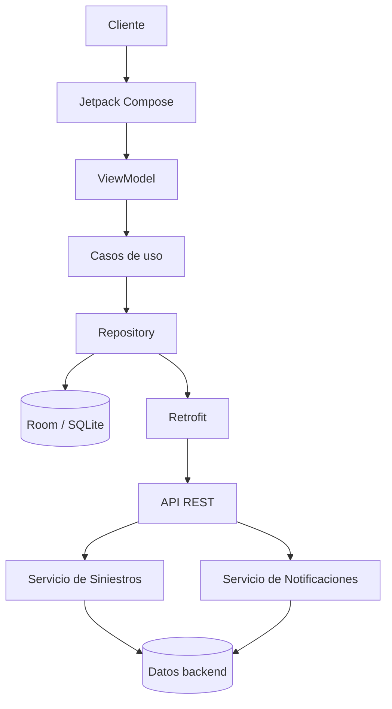
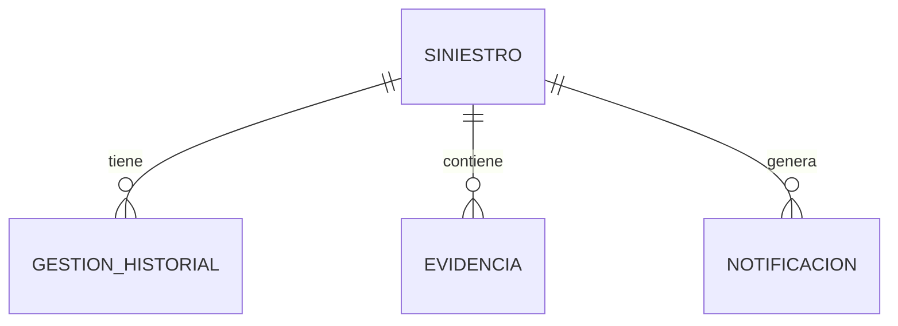
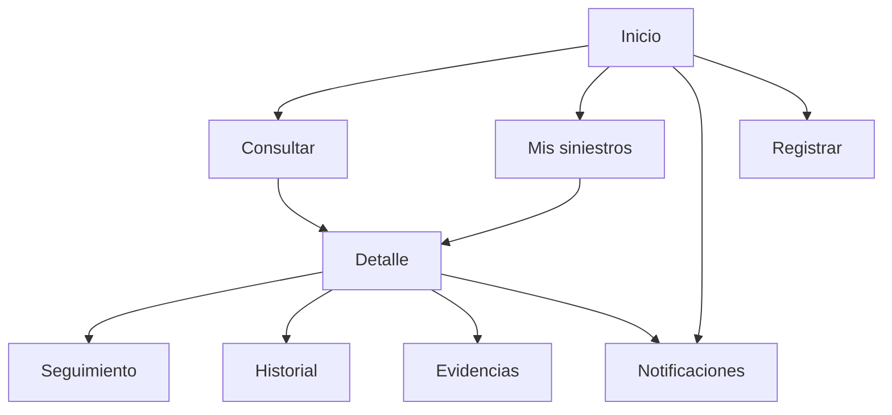

# DOCUMENTACIÓN MAESTRA · DSY1105

## Seguimiento móvil del estado de siniestros para clientes de servicios BPO

**Asignatura:** DSY1105 · Desarrollo de Aplicaciones Móviles  
**Organización del caso:** Servicios Corporativos Andes SpA  
**Estado del documento:** En evolución  
**Tipo de entrega:** MVP académico  
**Fuente principal:** Caso oficial DSY1105

---

# 1. Propósito del documento

Este archivo funciona como la **documentación central del proyecto**.

A medida que el proyecto avance, este documento deberá actualizarse para reflejar:

- requisitos,
- decisiones de arquitectura,
- diseño funcional,
- modelo de datos,
- API,
- pantallas,
- backlog,
- pruebas,
- decisiones técnicas,
- cambios de alcance,
- estado de implementación.

La intención es que exista una única fuente de verdad legible desde GitHub.

---

# 2. Problema que resuelve el proyecto

Servicios Corporativos Andes SpA participa en procesos BPO vinculados a la gestión de liquidación de siniestros para clientes del rubro asegurador.

Actualmente existe un alto componente manual en el proceso. El cliente que reporta un siniestro no dispone de un canal propio para conocer fácilmente el estado de su caso y debe recurrir a medios como:

- teléfono,
- correo electrónico,
- oficina,
- contacto directo con colaboradores.

Esto provoca:

- mayores tiempos percibidos de respuesta,
- baja trazabilidad visible para el cliente,
- más consultas manuales,
- mayor carga operativa,
- peor experiencia de servicio.

---

# 3. Solución propuesta

Construir un **MVP Android para seguimiento móvil de siniestros**.

La aplicación permitirá que un cliente pueda:

1. Registrar o consultar un siniestro.
2. Ver el estado actual.
3. Revisar el historial del caso.
4. Adjuntar evidencia o documentación.
5. Recibir notificaciones ante cambios relevantes.
6. Consultar información sin depender de atención manual.

El foco principal del MVP será el **cliente o asegurado**.

---

# 4. Objetivo general

Diseñar e implementar un MVP móvil que permita mejorar la visibilidad y trazabilidad del proceso de un siniestro mediante una experiencia Android simple, clara y de bajo esfuerzo cognitivo.

---

# 5. Objetivos específicos

- Permitir consultar un siniestro mediante un identificador ficticio.
- Mostrar el estado actual de forma comprensible.
- Mostrar el historial de gestiones.
- Permitir adjuntar evidencia sintética.
- Persistir información relevante localmente.
- Consumir una API REST desde Android.
- Implementar backend con Spring Boot.
- Mantener separación arquitectónica mediante MVVM.
- Demostrar cambios de estado y notificaciones.
- Utilizar únicamente datos ficticios, sintéticos o anonimizados.

---

# 6. Usuarios y actores

## 6.1 Cliente o asegurado

Usuario principal del MVP.

Necesita:

- conocer el estado de su siniestro,
- revisar avances,
- consultar historial,
- adjuntar documentos,
- recibir avisos.

## 6.2 Colaborador o liquidador

Actor del proceso que recibe y evalúa casos.

En el MVP académico no se plantea inicialmente una aplicación administrativa completa para este perfil.

## 6.3 Equipo de administración de siniestros

Actor encargado de normalizar y distribuir carga de trabajo.

Su operación productiva queda fuera del alcance del MVP.

---

# 7. Alcance del MVP

## Incluido

- Aplicación Android.
- Consulta de siniestros.
- Registro básico de siniestro si la planificación lo permite.
- Visualización del estado.
- Historial de gestiones.
- Evidencias.
- Notificaciones.
- Persistencia local.
- Integración Android/API.
- Backend Spring Boot.
- Pruebas unitarias de backend.
- Datos sintéticos.

## Fuera de alcance

- Login productivo.
- Integración real con aseguradoras.
- Sistemas core de pólizas.
- Información médica real.
- Información financiera real.
- Datos personales reales.
- Módulos productivos de normalización.
- Módulos productivos de distribución automática.
- Publicación comercial de la aplicación.
- Gestión administrativa completa de liquidadores.

---

# 8. Requisitos funcionales

## RF-01 · Consultar siniestro

El usuario debe poder consultar un siniestro ficticio mediante un identificador.

## RF-02 · Visualizar detalle

El sistema debe mostrar:

- identificador,
- tipo,
- fecha de ocurrencia,
- fecha de reporte,
- estado,
- equipo asignado,
- última actualización.

## RF-03 · Visualizar estado

El usuario debe poder identificar claramente la etapa actual del siniestro.

Estados mínimos:

1. RECIBIDO
2. EN_EVALUACION
3. EN_LIQUIDACION
4. CERRADO

## RF-04 · Consultar historial

El usuario debe poder visualizar las gestiones realizadas sobre su caso en orden cronológico.

## RF-05 · Adjuntar evidencia

El usuario debe poder adjuntar evidencia mediante:

- imagen,
- cámara,
- PDF.

## RF-06 · Consultar evidencias

El usuario debe poder ver los documentos o imágenes asociados al siniestro.

## RF-07 · Recibir notificaciones

El sistema debe representar notificaciones asociadas a cambios importantes del caso.

## RF-08 · Persistencia local

La aplicación debe guardar información relevante mediante Room/SQLite.

## RF-09 · Sincronización remota

La aplicación debe consumir información desde una API REST mediante Retrofit.

## RF-10 · Cambio de estado para demostración

El entorno académico debe permitir simular o ejecutar cambios de estado para demostrar actualización de historial y notificaciones.

---

# 9. Requisitos no funcionales

## RNF-01 · Plataforma

La aplicación debe ejecutarse en Android.

## RNF-02 · Lenguaje

Kotlin.

## RNF-03 · Interfaz

Jetpack Compose.

## RNF-04 · Sistema de diseño

Material Design 3.

## RNF-05 · Arquitectura

MVVM.

## RNF-06 · Persistencia local

Room / SQLite.

## RNF-07 · Comunicación

Retrofit + API REST.

## RNF-08 · Backend

Spring Boot.

## RNF-09 · Arquitectura backend

Microservicios.

## RNF-10 · Calidad

Pruebas unitarias en backend.

## RNF-11 · Privacidad

No utilizar información real de asegurados.

## RNF-12 · Usabilidad

La experiencia debe ser:

- simple,
- clara,
- comprensible,
- de bajo esfuerzo cognitivo.

---

# 10. Arquitectura general



---

# 11. Arquitectura Android

## Capa Presentation

Responsabilidades:

- pantallas,
- navegación,
- componentes,
- Material 3,
- ViewModels,
- UiState.

## Capa Domain

Responsabilidades:

- modelos de dominio,
- contratos,
- casos de uso,
- reglas simples del negocio.

## Capa Data

Responsabilidades:

- Retrofit,
- Room,
- DTO,
- entidades locales,
- mappers,
- repositories.

## Estructura propuesta

```text
app/
└── src/main/java/.../
    ├── data/
    │   ├── local/
    │   ├── remote/
    │   ├── mapper/
    │   └── repository/
    ├── domain/
    │   ├── model/
    │   ├── repository/
    │   └── usecase/
    ├── ui/
    │   ├── navigation/
    │   ├── screens/
    │   ├── components/
    │   └── theme/
    └── MainActivity.kt
```

---

# 12. Arquitectura backend

Se propone inicialmente separar las responsabilidades en dos servicios.

## 12.1 siniestros-service

Responsable de:

- crear siniestros ficticios,
- consultar siniestros,
- cambiar estados,
- consultar historial,
- asociar evidencias.

## 12.2 notificaciones-service

Responsable de:

- registrar notificaciones,
- consultar notificaciones,
- representar eventos de cambios importantes.

## Estructura propuesta

```text
backend/
├── siniestros-service/
│   └── src/main/java/.../
│       ├── controller/
│       ├── service/
│       ├── repository/
│       ├── model/
│       ├── dto/
│       └── exception/
└── notificaciones-service/
    └── src/main/java/.../
        ├── controller/
        ├── service/
        ├── repository/
        ├── model/
        └── dto/
```

---

# 13. Modelo de datos

## 13.1 Siniestro

Campos propuestos:

- id
- tipo
- fechaOcurrencia
- fechaReporte
- estado
- equipoAsignado
- ultimaActualizacion

## 13.2 GestionHistorial

- id
- siniestroId
- fechaHora
- descripcion
- estadoResultante

## 13.3 Evidencia

- id
- siniestroId
- nombreArchivo
- tipoMime
- uriLocal
- urlRemota
- fechaCarga
- estadoCarga

## 13.4 Notificacion

- id
- siniestroId
- titulo
- mensaje
- fechaHora
- leida

## Relaciones



---

# 14. Diseño de API REST

Base propuesta:

```text
/api/v1
```

## Siniestros

```http
GET /api/v1/siniestros
GET /api/v1/siniestros/{id}
POST /api/v1/siniestros
PATCH /api/v1/siniestros/{id}/estado
```

## Historial

```http
GET /api/v1/siniestros/{id}/historial
```

## Evidencias

```http
GET /api/v1/siniestros/{id}/evidencias
POST /api/v1/siniestros/{id}/evidencias
```

## Notificaciones

```http
GET /api/v1/notificaciones?siniestroId={id}
PATCH /api/v1/notificaciones/{id}/leida
```

---

# 15. Diseño de pantallas

## Pantalla 1 · Inicio

Funciones:

- acceder a siniestros,
- consultar un siniestro,
- acceder a notificaciones.

## Pantalla 2 · Consulta

Funciones:

- ingresar identificador,
- validar,
- consultar.

## Pantalla 3 · Mis siniestros

Funciones:

- mostrar tarjetas,
- mostrar estado,
- abrir detalle.

## Pantalla 4 · Detalle

Información:

- id,
- tipo,
- fechas,
- estado,
- equipo,
- última actualización.

Acciones:

- seguimiento,
- historial,
- evidencias,
- notificaciones.

## Pantalla 5 · Seguimiento

Timeline:

```text
Recibido ✓
   ↓
En evaluación ●
   ↓
En liquidación ○
   ↓
Cerrado ○
```

## Pantalla 6 · Historial

Lista cronológica de gestiones.

## Pantalla 7 · Evidencias

Funciones:

- listar,
- tomar foto,
- seleccionar imagen,
- seleccionar PDF.

## Pantalla 8 · Notificaciones

Funciones:

- listar cambios,
- marcar como leída,
- abrir siniestro relacionado.

## Pantalla 9 · Registro

Función opcional del MVP si existe tiempo suficiente.

---

# 16. Navegación



---

# 17. Flujo principal del MVP

```text
Cliente abre app
        ↓
Consulta SIN-2026-001
        ↓
Android solicita datos
        ↓
Retrofit
        ↓
API REST
        ↓
Spring Boot
        ↓
Respuesta JSON
        ↓
Repository
        ↓
Room
        ↓
ViewModel
        ↓
Compose
        ↓
Estado: EN EVALUACIÓN
```

---

# 18. Flujo de demostración final

La demo debe contar esta historia:

1. El cliente abre la aplicación.
2. Consulta un siniestro ficticio.
3. Ve el estado "En evaluación".
4. Abre el historial.
5. Revisa gestiones previas.
6. Adjunta una evidencia.
7. Se simula un cambio de estado.
8. El siniestro pasa a "En liquidación".
9. El sistema agrega un evento al historial.
10. El sistema genera una notificación.
11. Android actualiza la información.
12. El cliente visualiza el nuevo estado.

---

# 19. Estados de interfaz

Todas las pantallas conectadas a información remota deberán contemplar:

- Loading
- Success
- Empty
- Error

Ejemplo:

```text
Loading
"Cargando información..."

Error
"No pudimos actualizar el siniestro."

Empty
"No hay historial disponible todavía."
```

---

# 20. Principios UX

- lenguaje simple,
- pocas acciones por pantalla,
- estado claramente visible,
- navegación corta,
- evitar jerga innecesaria,
- no depender únicamente del color,
- tamaño táctil adecuado,
- contraste suficiente,
- mensajes de error comprensibles.

---

# 21. Estrategia de persistencia

Room se utilizará como persistencia local.

Objetivos:

- cachear siniestros,
- cachear historial,
- mantener notificaciones,
- conservar datos recientes,
- tolerar temporalmente fallos de conexión.

Flujo:

```text
API
 ↓
Repository
 ↓
Room
 ↓
ViewModel
 ↓
UI
```

---

# 22. Estrategia de evidencias

Flujo propuesto:

```text
Usuario
 ↓
Cámara / Imagen / PDF
 ↓
Android obtiene URI
 ↓
Validación
 ↓
Retrofit multipart
 ↓
Backend
 ↓
Registro de metadata
 ↓
Respuesta
 ↓
UI actualizada
```

---

# 23. Estrategia de notificaciones

Primera versión:

- notificación asociada al siniestro,
- persistida o simulada por backend,
- visible dentro de la app.

Versión opcional:

- Firebase Cloud Messaging.

La implementación de push real dependerá de la rúbrica y del tiempo disponible.

---

# 24. Backlog inicial

## P0 · Crítico

- Definir arquitectura.
- Definir modelo de datos.
- Definir API.
- Crear proyecto Android.
- Crear backend Spring Boot.
- Implementar consulta de siniestro.
- Implementar detalle.
- Implementar historial.
- Integrar Retrofit.
- Implementar Room.
- Agregar pruebas unitarias del backend.

## P1 · Importante

- Evidencias.
- Cámara.
- PDF.
- Notificaciones.
- Cambio de estado.
- Actualización del historial.

## P2 · Solo si la pauta o el tiempo lo justifican

- Registro más completo.
- Push real.
- Animaciones.
- Offline más elaborado.
- Cobertura adicional de errores.
- Pulido visual extra.

Estas mejoras no son prioridad. Primero se debe completar lo exigido por la pauta y el flujo principal del caso.

---

# 25. Orden de implementación

## Fase 0

Documentación.

## Fase 1

Proyecto Android y navegación.

## Fase 2

Backend mínimo.

## Fase 3

Integración Retrofit.

## Fase 4

Room.

## Fase 5

Evidencias.

## Fase 6

Cambios de estado + notificaciones.

## Fase 7

Pruebas y calidad.

## Fase 8

Demo y entrega.

---

# 26. Historias de usuario iniciales

## HU-01

**Como cliente**, quiero consultar mi siniestro, para saber en qué estado se encuentra.

### Criterios de aceptación

- permite ingresar o seleccionar un ID válido,
- consulta datos,
- muestra el estado,
- informa cuando el siniestro no existe.

## HU-02

**Como cliente**, quiero ver el historial de mi siniestro, para comprender qué gestiones se han realizado.

### Criterios de aceptación

- lista gestiones,
- muestra fecha,
- muestra descripción,
- mantiene orden cronológico.

## HU-03

**Como cliente**, quiero adjuntar evidencia, para aportar información al proceso.

### Criterios de aceptación

- permite seleccionar imagen o PDF,
- permite cámara cuando corresponda,
- informa progreso,
- confirma carga.

## HU-04

**Como cliente**, quiero recibir notificaciones, para enterarme de cambios importantes.

### Criterios de aceptación

- se genera una notificación al cambiar estado,
- puede visualizarse,
- puede asociarse al siniestro.

---

# 27. Matriz inicial de trazabilidad

| Requisito | Pantalla | Backend | Persistencia | Prueba |
|---|---|---|---|---|
| Consultar siniestro | Consulta / Detalle | GET /siniestros/{id} | Room | API + ViewModel |
| Ver estado | Detalle / Seguimiento | GET /siniestros/{id} | Room | UI + backend |
| Ver historial | Historial | GET /historial | Room | API |
| Adjuntar evidencia | Evidencias | POST /evidencias | Metadata local | API |
| Notificaciones | Notificaciones | GET /notificaciones | Room | Servicio |
| Cambio de estado | Seguimiento | PATCH /estado | Room sync | Servicio |

---

# 28. Pruebas previstas

## Backend

- consulta existente,
- consulta inexistente,
- creación,
- cambio de estado,
- generación de historial,
- generación de notificación,
- validaciones.

## Android

- ViewModels,
- repositories,
- mappers,
- manejo de estados,
- navegación principal.

## Integración

- Retrofit → API,
- API → JSON,
- Repository → Room,
- cambio de estado → historial,
- cambio de estado → notificación.

---

# 29. Datos de demostración

Ejemplo:

```json
{
  "id": "SIN-2026-001",
  "tipo": "Accidente vehicular",
  "fechaOcurrencia": "2026-09-20",
  "fechaReporte": "2026-09-21",
  "estado": "EN_EVALUACION",
  "equipoAsignado": "Equipo Norte"
}
```

Todos los datos deben ser ficticios.

---

# 30. Decisiones pendientes

Las siguientes decisiones todavía no deben considerarse definitivas:

- Base de datos del backend.
- H2 versus PostgreSQL.
- Push real versus notificaciones simuladas.
- Sistema definitivo de almacenamiento de archivos.
- Nivel de implementación del registro de siniestros.
- Estrategia de despliegue.
- Cobertura exacta de pruebas.
- Requisitos adicionales de la rúbrica.

---

# 31. Regla de trabajo del proyecto

La idea es hacer **lo necesario para cumplir bien la pauta**, sin agregar funciones solo porque se ven interesantes.

Antes de desarrollar algo se debe poder responder:

1. ¿La pauta o el caso lo pide?
2. ¿Qué requisito cubre?
3. ¿Qué pantalla lo necesita?
4. ¿Qué datos usa?
5. ¿Cómo se va a probar?
6. ¿Cómo se va a mostrar en la entrega?

Si una función no aporta a la evaluación ni al flujo principal, queda fuera del MVP.

---

# 32. Metodología de trabajo con GitFlow

Para ordenar el desarrollo se utilizará una versión simple de GitFlow.

## Ramas principales

### main

Contiene únicamente versiones estables del proyecto.

No se trabaja directamente sobre esta rama.

### develop

Es la rama donde se integran los cambios que ya fueron revisados antes de preparar una versión estable.

## Ramas de trabajo

### feature/*

Se utilizan para desarrollar funcionalidades.

Ejemplos:

```text
feature/consulta-siniestro
feature/historial-siniestro
feature/room
feature/evidencias
```

### docs/*

Se utilizan para cambios de documentación.

Ejemplo:

```text
docs/arquitectura-diseno-inicial
```

### release/*

Se utilizarán solamente cuando sea necesario preparar una entrega estable.

### hotfix/*

Se utilizarán solamente si aparece un error importante en una versión ya estable.

## Flujo básico

```text
main
 ↓
develop
 ↓
feature/* o docs/*
 ↓
Pull Request
 ↓
develop
 ↓
release/* cuando corresponda
 ↓
main
```

La idea no es complicar GitFlow. Se usará para mantener ordenado el trabajo y evitar desarrollar directamente sobre `main`.

---

# 33. Estado actual

## Completado

- Caso identificado.
- Problema comprendido.
- Alcance inicial definido.
- Arquitectura inicial propuesta.
- Diseño funcional inicial.
- Modelo de datos inicial.
- API inicial.
- Pantallas iniciales.
- Plan de implementación inicial.

## En progreso

- Consolidación de documentación.
- Revisión de decisiones arquitectónicas.

## Pendiente crítico

- Obtener y revisar la rúbrica oficial.
- Comparar la rúbrica con esta documentación.
- Quitar o simplificar cualquier elemento que no aporte puntaje ni sea necesario para el caso.
- Cerrar solo las decisiones técnicas necesarias para comenzar.
- Preparar el backlog mínimo de implementación.

---

# 34. Documentos complementarios

- [Caso DSY1105](../CASO_DSY1105_SEGUROS_BPO.md)
- [Visión y alcance](./00_VISION_Y_ALCANCE.md)
- [Arquitectura](./01_ARQUITECTURA.md)
- [Diseño funcional y UX](./02_DISENO_FUNCIONAL_Y_UX.md)
- [Modelo de datos](./03_MODELO_DE_DATOS.md)
- [Contrato API REST](./04_CONTRATO_API_REST.md)
- [Plan de implementación](./05_PLAN_DE_IMPLEMENTACION.md)

---

# 35. Historial de cambios

## v0.2

Se agrega la forma de trabajo con GitFlow y se ajusta el alcance para priorizar solamente lo necesario para la pauta.

## v0.1

Primera consolidación de la documentación:

- visión,
- alcance,
- requisitos,
- arquitectura,
- modelo de datos,
- API,
- UX,
- pantallas,
- backlog,
- pruebas,
- trazabilidad,
- decisiones pendientes.

---

> Este documento debe mantenerse actualizado durante todo el desarrollo del proyecto.
